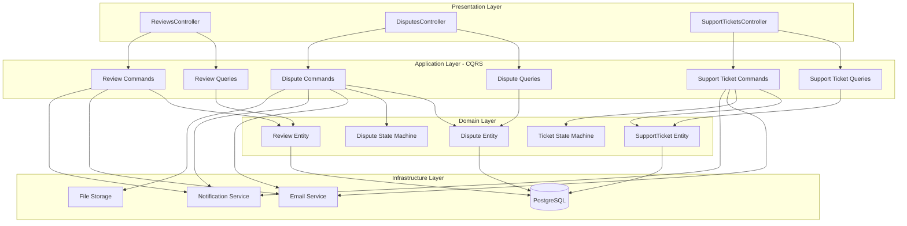
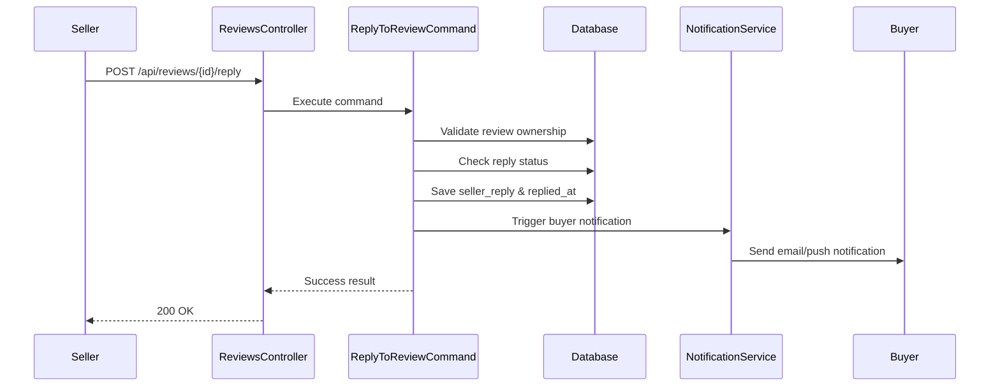
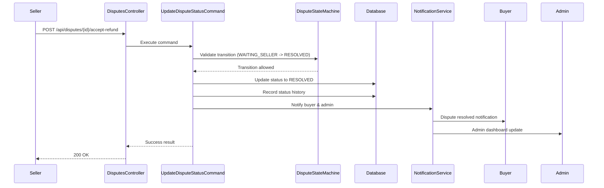
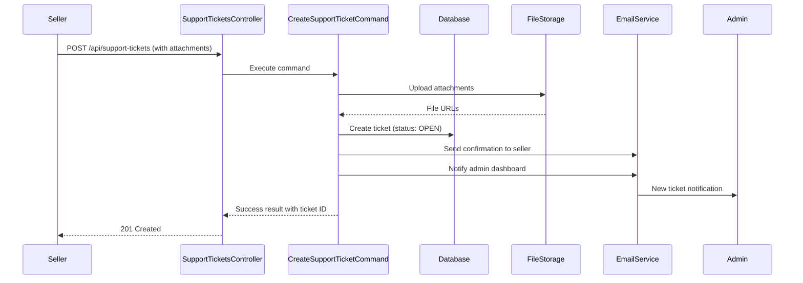
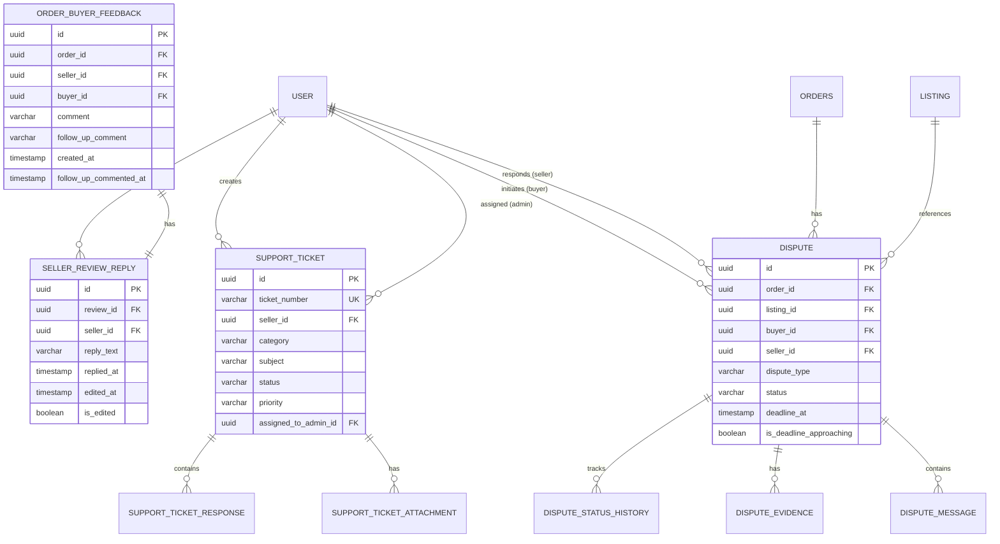
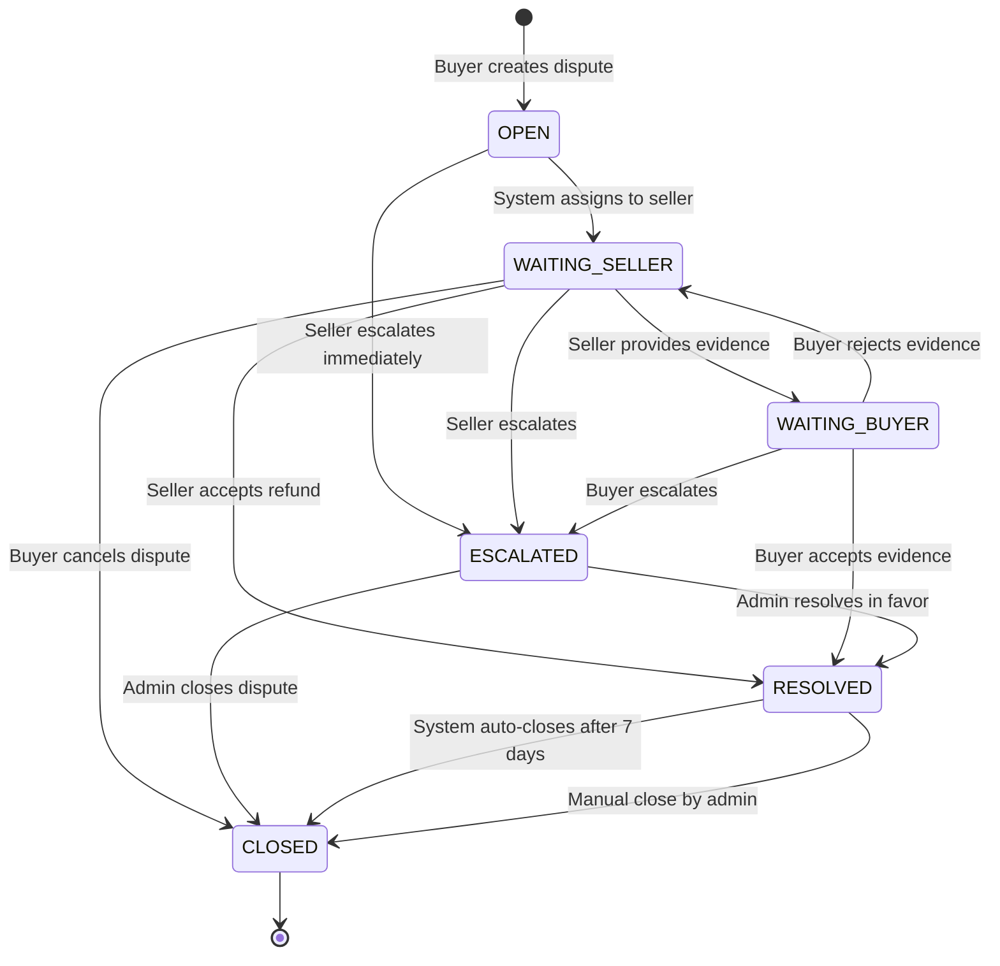
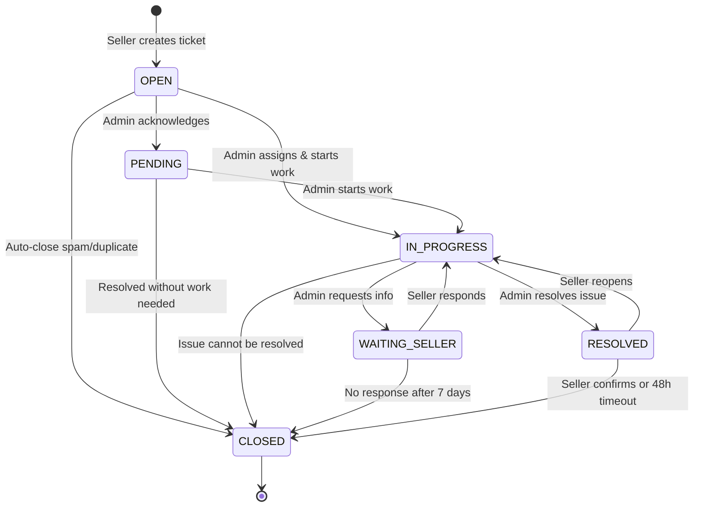

# Design Document: Customer Relations Module

## Overview

The Customer Relations Module is a comprehensive feature for the Seller role in an eBay clone platform. It enables sellers to manage customer feedback, handle disputes and returns, and communicate with platform administrators through a support ticket system. The module integrates with existing order, listing, and user management systems to provide a unified interface for all customer-facing interactions.

This module addresses four core business capabilities: viewing and responding to customer reviews/ratings, managing dispute resolution workflows with state-based transitions, tracking return requests, and submitting support tickets to administrators. The design follows CQRS patterns using MediatR, leverages PostgreSQL with EF Core for data persistence, and implements real-time notifications for critical events.

## Architecture



## Main Workflow Sequences

### Review Reply Workflow




### Dispute State Transition Workflow



### Support Ticket Creation Workflow




## Database Schema

### Table: seller_review_reply

Extends the existing `order_buyer_feedback` table to track seller responses to customer reviews.

```sql
CREATE TABLE seller_review_reply (
    id uuid NOT NULL,
    review_id uuid NOT NULL,
    seller_id uuid NOT NULL,
    reply_text character varying(500) NOT NULL,
    replied_at timestamp with time zone NOT NULL,
    edited_at timestamp with time zone,
    is_edited boolean NOT NULL DEFAULT false,
    created_at timestamp with time zone NOT NULL,
    created_by text,
    updated_at timestamp with time zone,
    updated_by text,
    is_deleted boolean NOT NULL DEFAULT false,
    CONSTRAINT pk_seller_review_reply PRIMARY KEY (id),
    CONSTRAINT fk_seller_review_reply_order_buyer_feedback FOREIGN KEY (review_id) 
        REFERENCES order_buyer_feedback (id) ON DELETE CASCADE,
    CONSTRAINT fk_seller_review_reply_user FOREIGN KEY (seller_id) 
        REFERENCES "user" (id) ON DELETE RESTRICT
);

CREATE INDEX ix_seller_review_reply_review_id ON seller_review_reply (review_id);
CREATE INDEX ix_seller_review_reply_seller_id ON seller_review_reply (seller_id);
CREATE UNIQUE INDEX ux_seller_review_reply_review ON seller_review_reply (review_id) 
    WHERE is_deleted = false;
```

**Fields:**
- `id`: Primary key (UUID)
- `review_id`: Foreign key to order_buyer_feedback table
- `seller_id`: Foreign key to user table (must match the seller from the order)
- `reply_text`: Seller's response (max 500 characters)
- `replied_at`: Timestamp when reply was first created
- `edited_at`: Timestamp of last edit (nullable)
- `is_edited`: Flag indicating if reply has been modified
- Standard audit fields: created_at, created_by, updated_at, updated_by, is_deleted

**Constraints:**
- One reply per review (enforced by unique index on review_id where not deleted)
- Seller must own the product being reviewed (validated in application layer)


### Table: dispute

Manages dispute and return cases with state machine workflow.

```sql
CREATE TABLE dispute (
    id uuid NOT NULL,
    order_id uuid NOT NULL,
    listing_id uuid NOT NULL,
    buyer_id uuid NOT NULL,
    seller_id uuid NOT NULL,
    dispute_type character varying(50) NOT NULL,
    reason text NOT NULL,
    status character varying(50) NOT NULL,
    resolution_type character varying(50),
    refund_amount numeric(18,2),
    refund_currency character varying(3),
    opened_at timestamp with time zone NOT NULL,
    resolved_at timestamp with time zone,
    closed_at timestamp with time zone,
    escalated_at timestamp with time zone,
    deadline_at timestamp with time zone,
    is_deadline_approaching boolean NOT NULL DEFAULT false,
    created_at timestamp with time zone NOT NULL,
    created_by text,
    updated_at timestamp with time zone,
    updated_by text,
    is_deleted boolean NOT NULL DEFAULT false,
    CONSTRAINT pk_dispute PRIMARY KEY (id),
    CONSTRAINT fk_dispute_orders FOREIGN KEY (order_id) 
        REFERENCES orders (id) ON DELETE CASCADE,
    CONSTRAINT fk_dispute_listing FOREIGN KEY (listing_id) 
        REFERENCES listing (id) ON DELETE RESTRICT,
    CONSTRAINT fk_dispute_buyer FOREIGN KEY (buyer_id) 
        REFERENCES "user" (id) ON DELETE RESTRICT,
    CONSTRAINT fk_dispute_seller FOREIGN KEY (seller_id) 
        REFERENCES "user" (id) ON DELETE RESTRICT,
    CONSTRAINT chk_dispute_status CHECK (status IN 
        ('OPEN', 'WAITING_SELLER', 'WAITING_BUYER', 'ESCALATED', 'RESOLVED', 'CLOSED')),
    CONSTRAINT chk_dispute_type CHECK (dispute_type IN 
        ('RETURN_REQUEST', 'REFUND_REQUEST', 'ITEM_NOT_RECEIVED', 'ITEM_NOT_AS_DESCRIBED', 'OTHER'))
);

CREATE INDEX ix_dispute_order_id ON dispute (order_id);
CREATE INDEX ix_dispute_seller_id ON dispute (seller_id);
CREATE INDEX ix_dispute_buyer_id ON dispute (buyer_id);
CREATE INDEX ix_dispute_status ON dispute (status);
CREATE INDEX ix_dispute_deadline_approaching ON dispute (is_deadline_approaching, status) 
    WHERE is_deleted = false;
```


**Fields:**
- `id`: Primary key (UUID)
- `order_id`: Foreign key to orders table
- `listing_id`: Foreign key to listing table
- `buyer_id`: Foreign key to user table (dispute initiator)
- `seller_id`: Foreign key to user table (dispute respondent)
- `dispute_type`: Type of dispute (enum)
- `reason`: Detailed reason for dispute
- `status`: Current state in workflow (enum)
- `resolution_type`: How dispute was resolved (nullable)
- `refund_amount`: Refund amount if applicable (nullable)
- `refund_currency`: Currency code (nullable)
- `opened_at`: When dispute was created
- `resolved_at`: When dispute reached RESOLVED status (nullable)
- `closed_at`: When dispute was closed (nullable)
- `escalated_at`: When dispute was escalated to admin (nullable)
- `deadline_at`: Seller response deadline (nullable)
- `is_deadline_approaching`: Flag for urgent cases (within 24 hours)
- Standard audit fields

**Status Values:**
- `OPEN`: Initial state when buyer creates dispute
- `WAITING_SELLER`: Awaiting seller response/action
- `WAITING_BUYER`: Awaiting buyer response (after seller provides evidence)
- `ESCALATED`: Escalated to admin for arbitration
- `RESOLVED`: Dispute resolved (refund issued or agreement reached)
- `CLOSED`: Dispute closed (final state)

**Dispute Types:**
- `RETURN_REQUEST`: Buyer wants to return item
- `REFUND_REQUEST`: Buyer wants refund without return
- `ITEM_NOT_RECEIVED`: Item never arrived
- `ITEM_NOT_AS_DESCRIBED`: Item doesn't match listing
- `OTHER`: Other issues


### Table: dispute_message

Tracks communication history within a dispute.

```sql
CREATE TABLE dispute_message (
    id uuid NOT NULL,
    dispute_id uuid NOT NULL,
    sender_id uuid NOT NULL,
    sender_role character varying(20) NOT NULL,
    message_text text NOT NULL,
    sent_at timestamp with time zone NOT NULL,
    created_at timestamp with time zone NOT NULL,
    created_by text,
    updated_at timestamp with time zone,
    updated_by text,
    is_deleted boolean NOT NULL DEFAULT false,
    CONSTRAINT pk_dispute_message PRIMARY KEY (id),
    CONSTRAINT fk_dispute_message_dispute FOREIGN KEY (dispute_id) 
        REFERENCES dispute (id) ON DELETE CASCADE,
    CONSTRAINT fk_dispute_message_sender FOREIGN KEY (sender_id) 
        REFERENCES "user" (id) ON DELETE RESTRICT,
    CONSTRAINT chk_sender_role CHECK (sender_role IN ('BUYER', 'SELLER', 'ADMIN'))
);

CREATE INDEX ix_dispute_message_dispute_id ON dispute_message (dispute_id);
CREATE INDEX ix_dispute_message_sent_at ON dispute_message (sent_at DESC);
```

**Fields:**
- `id`: Primary key (UUID)
- `dispute_id`: Foreign key to dispute table
- `sender_id`: User who sent the message
- `sender_role`: Role of sender (BUYER, SELLER, ADMIN)
- `message_text`: Message content
- `sent_at`: Timestamp when message was sent
- Standard audit fields


### Table: dispute_evidence

Stores evidence files uploaded during dispute resolution.

```sql
CREATE TABLE dispute_evidence (
    id uuid NOT NULL,
    dispute_id uuid NOT NULL,
    uploaded_by_id uuid NOT NULL,
    file_name character varying(255) NOT NULL,
    file_url character varying(1024) NOT NULL,
    file_type character varying(100) NOT NULL,
    file_size bigint NOT NULL,
    description character varying(500),
    uploaded_at timestamp with time zone NOT NULL,
    created_at timestamp with time zone NOT NULL,
    created_by text,
    updated_at timestamp with time zone,
    updated_by text,
    is_deleted boolean NOT NULL DEFAULT false,
    CONSTRAINT pk_dispute_evidence PRIMARY KEY (id),
    CONSTRAINT fk_dispute_evidence_dispute FOREIGN KEY (dispute_id) 
        REFERENCES dispute (id) ON DELETE CASCADE,
    CONSTRAINT fk_dispute_evidence_uploader FOREIGN KEY (uploaded_by_id) 
        REFERENCES "user" (id) ON DELETE RESTRICT
);

CREATE INDEX ix_dispute_evidence_dispute_id ON dispute_evidence (dispute_id);
CREATE INDEX ix_dispute_evidence_uploaded_at ON dispute_evidence (uploaded_at DESC);
```

**Fields:**
- `id`: Primary key (UUID)
- `dispute_id`: Foreign key to dispute table
- `uploaded_by_id`: User who uploaded the file
- `file_name`: Original file name
- `file_url`: Storage URL for the file
- `file_type`: MIME type
- `file_size`: File size in bytes
- `description`: Optional description of evidence
- `uploaded_at`: Upload timestamp
- Standard audit fields


### Table: dispute_status_history

Audit trail for dispute state transitions.

```sql
CREATE TABLE dispute_status_history (
    id uuid NOT NULL,
    dispute_id uuid NOT NULL,
    from_status character varying(50) NOT NULL,
    to_status character varying(50) NOT NULL,
    changed_by_id uuid NOT NULL,
    changed_by_role character varying(20) NOT NULL,
    reason text,
    changed_at timestamp with time zone NOT NULL,
    CONSTRAINT pk_dispute_status_history PRIMARY KEY (id),
    CONSTRAINT fk_dispute_status_history_dispute FOREIGN KEY (dispute_id) 
        REFERENCES dispute (id) ON DELETE CASCADE,
    CONSTRAINT fk_dispute_status_history_user FOREIGN KEY (changed_by_id) 
        REFERENCES "user" (id) ON DELETE RESTRICT
);

CREATE INDEX ix_dispute_status_history_dispute_id ON dispute_status_history (dispute_id);
CREATE INDEX ix_dispute_status_history_changed_at ON dispute_status_history (changed_at DESC);
```

**Fields:**
- `id`: Primary key (UUID)
- `dispute_id`: Foreign key to dispute table
- `from_status`: Previous status
- `to_status`: New status
- `changed_by_id`: User who triggered the transition
- `changed_by_role`: Role of user (BUYER, SELLER, ADMIN, SYSTEM)
- `reason`: Optional reason for status change
- `changed_at`: Timestamp of transition


### Table: support_ticket

Manages seller-to-admin support tickets.

```sql
CREATE TABLE support_ticket (
    id uuid NOT NULL,
    ticket_number character varying(50) NOT NULL,
    seller_id uuid NOT NULL,
    category character varying(100) NOT NULL,
    subject character varying(200) NOT NULL,
    message text NOT NULL,
    status character varying(50) NOT NULL,
    priority character varying(20) NOT NULL DEFAULT 'NORMAL',
    assigned_to_admin_id uuid,
    created_at timestamp with time zone NOT NULL,
    created_by text,
    updated_at timestamp with time zone,
    updated_by text,
    resolved_at timestamp with time zone,
    closed_at timestamp with time zone,
    is_deleted boolean NOT NULL DEFAULT false,
    CONSTRAINT pk_support_ticket PRIMARY KEY (id),
    CONSTRAINT fk_support_ticket_seller FOREIGN KEY (seller_id) 
        REFERENCES "user" (id) ON DELETE RESTRICT,
    CONSTRAINT fk_support_ticket_admin FOREIGN KEY (assigned_to_admin_id) 
        REFERENCES "user" (id) ON DELETE SET NULL,
    CONSTRAINT chk_support_ticket_status CHECK (status IN 
        ('OPEN', 'PENDING', 'IN_PROGRESS', 'WAITING_SELLER', 'RESOLVED', 'CLOSED')),
    CONSTRAINT chk_support_ticket_priority CHECK (priority IN 
        ('LOW', 'NORMAL', 'HIGH', 'URGENT'))
);

CREATE UNIQUE INDEX ux_support_ticket_number ON support_ticket (ticket_number);
CREATE INDEX ix_support_ticket_seller_id ON support_ticket (seller_id);
CREATE INDEX ix_support_ticket_status ON support_ticket (status);
CREATE INDEX ix_support_ticket_created_at ON support_ticket (created_at DESC);
```


**Fields:**
- `id`: Primary key (UUID)
- `ticket_number`: Unique human-readable identifier (e.g., "TKT-2024-00001")
- `seller_id`: Foreign key to user table (ticket creator)
- `category`: Ticket category (e.g., "Account", "Payment", "Technical", "Policy")
- `subject`: Brief summary (max 200 characters)
- `message`: Detailed description
- `status`: Current ticket status (enum)
- `priority`: Ticket priority level (enum)
- `assigned_to_admin_id`: Admin assigned to handle ticket (nullable)
- `resolved_at`: When ticket was marked resolved (nullable)
- `closed_at`: When ticket was closed (nullable)
- Standard audit fields

**Status Values:**
- `OPEN`: Newly created, awaiting admin review
- `PENDING`: Acknowledged by admin, not yet assigned
- `IN_PROGRESS`: Admin actively working on ticket
- `WAITING_SELLER`: Awaiting seller response
- `RESOLVED`: Issue resolved, awaiting confirmation
- `CLOSED`: Ticket closed (final state)

**Priority Values:**
- `LOW`: Non-urgent inquiry
- `NORMAL`: Standard priority (default)
- `HIGH`: Important issue requiring prompt attention
- `URGENT`: Critical issue requiring immediate attention


### Table: support_ticket_attachment

Stores file attachments for support tickets.

```sql
CREATE TABLE support_ticket_attachment (
    id uuid NOT NULL,
    ticket_id uuid NOT NULL,
    file_name character varying(255) NOT NULL,
    file_url character varying(1024) NOT NULL,
    file_type character varying(100) NOT NULL,
    file_size bigint NOT NULL,
    uploaded_at timestamp with time zone NOT NULL,
    created_at timestamp with time zone NOT NULL,
    created_by text,
    updated_at timestamp with time zone,
    updated_by text,
    is_deleted boolean NOT NULL DEFAULT false,
    CONSTRAINT pk_support_ticket_attachment PRIMARY KEY (id),
    CONSTRAINT fk_support_ticket_attachment_ticket FOREIGN KEY (ticket_id) 
        REFERENCES support_ticket (id) ON DELETE CASCADE
);

CREATE INDEX ix_support_ticket_attachment_ticket_id ON support_ticket_attachment (ticket_id);
```

**Fields:**
- `id`: Primary key (UUID)
- `ticket_id`: Foreign key to support_ticket table
- `file_name`: Original file name
- `file_url`: Storage URL
- `file_type`: MIME type
- `file_size`: File size in bytes
- `uploaded_at`: Upload timestamp
- Standard audit fields


### Table: support_ticket_response

Tracks conversation thread within a support ticket.

```sql
CREATE TABLE support_ticket_response (
    id uuid NOT NULL,
    ticket_id uuid NOT NULL,
    responder_id uuid NOT NULL,
    responder_role character varying(20) NOT NULL,
    message text NOT NULL,
    is_internal_note boolean NOT NULL DEFAULT false,
    responded_at timestamp with time zone NOT NULL,
    created_at timestamp with time zone NOT NULL,
    created_by text,
    updated_at timestamp with time zone,
    updated_by text,
    is_deleted boolean NOT NULL DEFAULT false,
    CONSTRAINT pk_support_ticket_response PRIMARY KEY (id),
    CONSTRAINT fk_support_ticket_response_ticket FOREIGN KEY (ticket_id) 
        REFERENCES support_ticket (id) ON DELETE CASCADE,
    CONSTRAINT fk_support_ticket_response_responder FOREIGN KEY (responder_id) 
        REFERENCES "user" (id) ON DELETE RESTRICT,
    CONSTRAINT chk_responder_role CHECK (responder_role IN ('SELLER', 'ADMIN'))
);

CREATE INDEX ix_support_ticket_response_ticket_id ON support_ticket_response (ticket_id);
CREATE INDEX ix_support_ticket_response_responded_at ON support_ticket_response (responded_at DESC);
```

**Fields:**
- `id`: Primary key (UUID)
- `ticket_id`: Foreign key to support_ticket table
- `responder_id`: User who responded
- `responder_role`: Role of responder (SELLER or ADMIN)
- `message`: Response content
- `is_internal_note`: Flag for admin-only notes (not visible to seller)
- `responded_at`: Response timestamp
- Standard audit fields


### Database Relationships Diagram




## API Design

### Reviews API

#### GET /api/reviews

Query reviews/ratings for a seller with filtering options.

**Authorization:** Required (Seller role)

**Query Parameters:**
```csharp
public sealed record ReviewFilterDto
{
    public Guid? SellerId { get; init; }
    public DateTime? FromDate { get; init; }
    public DateTime? ToDate { get; init; }
    public int? MinStarRating { get; init; }
    public int? MaxStarRating { get; init; }
    public bool? HasReply { get; init; }
    public int PageNumber { get; init; } = 1;
    public int PageSize { get; init; } = 20;
    public string? SortBy { get; init; } = "CreatedAt";
    public string? SortOrder { get; init; } = "DESC";
}
```

**Response:** 200 OK
```csharp
public sealed record ReviewListResponse
{
    public List<ReviewDto> Reviews { get; init; }
    public int TotalCount { get; init; }
    public int PageNumber { get; init; }
    public int PageSize { get; init; }
    public decimal AverageRating { get; init; }
}

public sealed record ReviewDto
{
    public Guid Id { get; init; }
    public Guid OrderId { get; init; }
    public Guid ListingId { get; init; }
    public Guid BuyerId { get; init; }
    public string BuyerUsername { get; init; }
    public int StarRating { get; init; }
    public string Comment { get; init; }
    public DateTime CreatedAt { get; init; }
    public string? SellerReply { get; init; }
    public DateTime? RepliedAt { get; init; }
    public bool HasReply { get; init; }
}
```


**Validation Rules:**
- `SellerId` must match authenticated user's ID (or be omitted to default to current user)
- `MinStarRating` and `MaxStarRating` must be between 1 and 5
- `PageSize` must be between 1 and 100
- Date range: `ToDate` must be after `FromDate` if both provided

**Business Logic:**
- Calculate average rating across all reviews for the seller
- Prioritize 1-3 star ratings when `SortBy` is "Priority"
- Filter by reply status: `HasReply=false` shows unreplied reviews

#### POST /api/reviews/{reviewId}/reply

Seller replies to a customer review.

**Authorization:** Required (Seller role)

**Path Parameters:**
- `reviewId` (UUID): ID of the review to reply to

**Request Body:**
```csharp
public sealed record ReplyToReviewRequest
{
    public string Reply { get; init; }
}
```

**Response:** 200 OK (no body)

**Validation Rules:**
- `Reply` is required, max 500 characters
- `Reply` must not be empty or whitespace only
- Review must exist and not be deleted
- Review must belong to a product owned by the authenticated seller
- Review must not already have a reply (or allow editing if reply exists)

**Business Logic:**
1. Validate review ownership (review.seller_id matches authenticated user)
2. Check if reply already exists
3. If no reply exists: Create new `seller_review_reply` record
4. If reply exists: Update existing reply, set `is_edited=true`, update `edited_at`
5. Trigger notification to buyer via email and push notification
6. Return success


#### GET /api/reviews/{reviewId}

Get detailed information about a specific review.

**Authorization:** Required (Seller role)

**Path Parameters:**
- `reviewId` (UUID): ID of the review

**Response:** 200 OK
```csharp
public sealed record ReviewDetailDto
{
    public Guid Id { get; init; }
    public Guid OrderId { get; init; }
    public string OrderNumber { get; init; }
    public Guid ListingId { get; init; }
    public string ListingTitle { get; init; }
    public Guid BuyerId { get; init; }
    public string BuyerUsername { get; init; }
    public string BuyerEmail { get; init; }
    public int StarRating { get; init; }
    public string Comment { get; init; }
    public string? FollowUpComment { get; init; }
    public DateTime CreatedAt { get; init; }
    public DateTime? FollowUpCommentedAt { get; init; }
    public SellerReplyDto? SellerReply { get; init; }
}

public sealed record SellerReplyDto
{
    public Guid Id { get; init; }
    public string ReplyText { get; init; }
    public DateTime RepliedAt { get; init; }
    public DateTime? EditedAt { get; init; }
    public bool IsEdited { get; init; }
}
```

**Validation Rules:**
- Review must exist and belong to authenticated seller's products
- Return 404 if review not found or doesn't belong to seller


### Disputes API

#### GET /api/disputes

Query disputes for a seller with filtering options.

**Authorization:** Required (Seller role)

**Query Parameters:**
```csharp
public sealed record DisputeFilterDto
{
    public Guid? SellerId { get; init; }
    public string? Status { get; init; }
    public string? DisputeType { get; init; }
    public bool? IsDeadlineApproaching { get; init; }
    public DateTime? FromDate { get; init; }
    public DateTime? ToDate { get; init; }
    public int PageNumber { get; init; } = 1;
    public int PageSize { get; init; } = 20;
    public string? SortBy { get; init; } = "OpenedAt";
    public string? SortOrder { get; init; } = "DESC";
}
```

**Response:** 200 OK
```csharp
public sealed record DisputeListResponse
{
    public List<DisputeSummaryDto> Disputes { get; init; }
    public int TotalCount { get; init; }
    public int PageNumber { get; init; }
    public int PageSize { get; init; }
    public int WaitingSellerCount { get; init; }
    public int DeadlineApproachingCount { get; init; }
}

public sealed record DisputeSummaryDto
{
    public Guid Id { get; init; }
    public Guid OrderId { get; init; }
    public string OrderNumber { get; init; }
    public Guid ListingId { get; init; }
    public string ListingTitle { get; init; }
    public string DisputeType { get; init; }
    public string Status { get; init; }
    public DateTime OpenedAt { get; init; }
    public DateTime? DeadlineAt { get; init; }
    public bool IsDeadlineApproaching { get; init; }
    public int MessageCount { get; init; }
}
```


**Validation Rules:**
- `Status` must be valid enum value if provided
- `DisputeType` must be valid enum value if provided
- `PageSize` must be between 1 and 100
- Date range validation

**Business Logic:**
- Highlight disputes with `status=WAITING_SELLER` and `is_deadline_approaching=true`
- Calculate `WaitingSellerCount` and `DeadlineApproachingCount` for dashboard metrics
- Default sort prioritizes urgent cases (deadline approaching first)

#### GET /api/disputes/{disputeId}

Get detailed information about a specific dispute.

**Authorization:** Required (Seller or Buyer role)

**Path Parameters:**
- `disputeId` (UUID): ID of the dispute

**Response:** 200 OK
```csharp
public sealed record DisputeDetailDto
{
    public Guid Id { get; init; }
    public Guid OrderId { get; init; }
    public string OrderNumber { get; init; }
    public Guid ListingId { get; init; }
    public string ListingTitle { get; init; }
    public Guid BuyerId { get; init; }
    public string BuyerUsername { get; init; }
    public Guid SellerId { get; init; }
    public string SellerUsername { get; init; }
    public string DisputeType { get; init; }
    public string Reason { get; init; }
    public string Status { get; init; }
    public string? ResolutionType { get; init; }
    public decimal? RefundAmount { get; init; }
    public string? RefundCurrency { get; init; }
    public DateTime OpenedAt { get; init; }
    public DateTime? ResolvedAt { get; init; }
    public DateTime? ClosedAt { get; init; }
    public DateTime? EscalatedAt { get; init; }
    public DateTime? DeadlineAt { get; init; }
    public bool IsDeadlineApproaching { get; init; }
    public List<DisputeMessageDto> Messages { get; init; }
    public List<DisputeEvidenceDto> Evidence { get; init; }
    public List<DisputeStatusHistoryDto> StatusHistory { get; init; }
}
```


#### POST /api/disputes/{disputeId}/accept-refund

Seller accepts the dispute and issues a refund.

**Authorization:** Required (Seller role)

**Path Parameters:**
- `disputeId` (UUID): ID of the dispute

**Request Body:**
```csharp
public sealed record AcceptRefundRequest
{
    public decimal RefundAmount { get; init; }
    public string? Message { get; init; }
}
```

**Response:** 200 OK (no body)

**Validation Rules:**
- Dispute must exist and belong to authenticated seller
- Current status must be `WAITING_SELLER`
- `RefundAmount` must be positive and not exceed order total
- `Message` is optional, max 1000 characters

**Business Logic:**
1. Validate state transition (WAITING_SELLER → RESOLVED)
2. Update dispute status to `RESOLVED`
3. Set `resolution_type = "REFUND_ISSUED"`
4. Set `refund_amount` and `refund_currency`
5. Set `resolved_at` timestamp
6. Create status history record
7. Trigger refund processing (integration with payment system)
8. Notify buyer and admin
9. Return success


#### POST /api/disputes/{disputeId}/provide-evidence

Seller uploads evidence to support their case.

**Authorization:** Required (Seller role)

**Path Parameters:**
- `disputeId` (UUID): ID of the dispute

**Request Body:** multipart/form-data
```csharp
public sealed record ProvideEvidenceRequest
{
    public IFormFileCollection Files { get; init; }
    public string? Description { get; init; }
}
```

**Response:** 200 OK (no body)

**Validation Rules:**
- Dispute must exist and belong to authenticated seller
- Current status must be `WAITING_SELLER` or `OPEN`
- Maximum 10 files per upload
- Each file max 10MB
- Allowed file types: images (jpg, png, gif), PDF, documents (doc, docx)
- `Description` is optional, max 500 characters

**Business Logic:**
1. Validate file uploads (size, type, count)
2. Upload files to storage service
3. Create `dispute_evidence` records for each file
4. Update dispute status to `WAITING_BUYER`
5. Create status history record
6. Notify buyer that evidence has been provided
7. Return success

#### POST /api/disputes/{disputeId}/escalate

Seller escalates dispute to admin for arbitration.

**Authorization:** Required (Seller role)

**Path Parameters:**
- `disputeId` (UUID): ID of the dispute

**Request Body:**
```csharp
public sealed record EscalateDisputeRequest
{
    public string Reason { get; init; }
}
```

**Response:** 200 OK (no body)


**Validation Rules:**
- Dispute must exist and belong to authenticated seller
- Current status must be `WAITING_SELLER`, `WAITING_BUYER`, or `OPEN`
- `Reason` is required, max 1000 characters

**Business Logic:**
1. Validate state transition (current → ESCALATED)
2. Update dispute status to `ESCALATED`
3. Set `escalated_at` timestamp
4. Create status history record with reason
5. Notify admin dashboard (high priority)
6. Notify buyer that dispute has been escalated
7. Return success

#### POST /api/disputes/{disputeId}/messages

Add a message to the dispute conversation.

**Authorization:** Required (Seller or Buyer role)

**Path Parameters:**
- `disputeId` (UUID): ID of the dispute

**Request Body:**
```csharp
public sealed record AddDisputeMessageRequest
{
    public string Message { get; init; }
}
```

**Response:** 201 Created
```csharp
public sealed record DisputeMessageDto
{
    public Guid Id { get; init; }
    public Guid SenderId { get; init; }
    public string SenderUsername { get; init; }
    public string SenderRole { get; init; }
    public string MessageText { get; init; }
    public DateTime SentAt { get; init; }
}
```

**Validation Rules:**
- Dispute must exist
- User must be either buyer or seller of the dispute
- `Message` is required, max 2000 characters
- Dispute must not be in `CLOSED` status


### Support Tickets API

#### GET /api/support-tickets

Query support tickets for a seller.

**Authorization:** Required (Seller role)

**Query Parameters:**
```csharp
public sealed record SupportTicketFilterDto
{
    public Guid? SellerId { get; init; }
    public string? Status { get; init; }
    public string? Category { get; init; }
    public string? Priority { get; init; }
    public DateTime? FromDate { get; init; }
    public DateTime? ToDate { get; init; }
    public int PageNumber { get; init; } = 1;
    public int PageSize { get; init; } = 20;
    public string? SortBy { get; init; } = "CreatedAt";
    public string? SortOrder { get; init; } = "DESC";
}
```

**Response:** 200 OK
```csharp
public sealed record SupportTicketListResponse
{
    public List<SupportTicketSummaryDto> Tickets { get; init; }
    public int TotalCount { get; init; }
    public int PageNumber { get; init; }
    public int PageSize { get; init; }
    public int OpenCount { get; init; }
    public int PendingCount { get; init; }
}

public sealed record SupportTicketSummaryDto
{
    public Guid Id { get; init; }
    public string TicketNumber { get; init; }
    public string Category { get; init; }
    public string Subject { get; init; }
    public string Status { get; init; }
    public string Priority { get; init; }
    public DateTime CreatedAt { get; init; }
    public DateTime? UpdatedAt { get; init; }
    public int ResponseCount { get; init; }
    public bool HasUnreadResponses { get; init; }
}
```


#### POST /api/support-tickets

Create a new support ticket.

**Authorization:** Required (Seller role)

**Request Body:** multipart/form-data
```csharp
public sealed record CreateSupportTicketRequest
{
    public string Category { get; init; }
    public string Subject { get; init; }
    public string Message { get; init; }
    public string? Priority { get; init; }
    public IFormFileCollection? Attachments { get; init; }
}
```

**Response:** 201 Created
```csharp
public sealed record CreateSupportTicketResponse
{
    public Guid Id { get; init; }
    public string TicketNumber { get; init; }
    public string Status { get; init; }
    public DateTime CreatedAt { get; init; }
}
```

**Validation Rules:**
- `Category` is required, must be one of: "Account", "Payment", "Technical", "Policy", "Shipping", "Other"
- `Subject` is required, max 200 characters
- `Message` is required, max 5000 characters
- `Priority` is optional, defaults to "NORMAL", must be valid enum value
- `Attachments` is optional, max 5 files, each max 10MB
- Allowed file types: images, PDF, documents

**Business Logic:**
1. Generate unique ticket number (format: "TKT-YYYY-NNNNN")
2. Create `support_ticket` record with status `OPEN`
3. Upload attachments to storage if provided
4. Create `support_ticket_attachment` records
5. Send confirmation email to seller
6. Notify admin dashboard (real-time notification)
7. Return ticket details


#### GET /api/support-tickets/{ticketId}

Get detailed information about a specific support ticket.

**Authorization:** Required (Seller role)

**Path Parameters:**
- `ticketId` (UUID): ID of the ticket

**Response:** 200 OK
```csharp
public sealed record SupportTicketDetailDto
{
    public Guid Id { get; init; }
    public string TicketNumber { get; init; }
    public string Category { get; init; }
    public string Subject { get; init; }
    public string Message { get; init; }
    public string Status { get; init; }
    public string Priority { get; init; }
    public Guid? AssignedToAdminId { get; init; }
    public string? AssignedToAdminName { get; init; }
    public DateTime CreatedAt { get; init; }
    public DateTime? UpdatedAt { get; init; }
    public DateTime? ResolvedAt { get; init; }
    public DateTime? ClosedAt { get; init; }
    public List<SupportTicketAttachmentDto> Attachments { get; init; }
    public List<SupportTicketResponseDto> Responses { get; init; }
}

public sealed record SupportTicketAttachmentDto
{
    public Guid Id { get; init; }
    public string FileName { get; init; }
    public string FileUrl { get; init; }
    public string FileType { get; init; }
    public long FileSize { get; init; }
    public DateTime UploadedAt { get; init; }
}

public sealed record SupportTicketResponseDto
{
    public Guid Id { get; init; }
    public Guid ResponderId { get; init; }
    public string ResponderName { get; init; }
    public string ResponderRole { get; init; }
    public string Message { get; init; }
    public DateTime RespondedAt { get; init; }
}
```


#### POST /api/support-tickets/{ticketId}/responses

Add a response to a support ticket.

**Authorization:** Required (Seller role)

**Path Parameters:**
- `ticketId` (UUID): ID of the ticket

**Request Body:**
```csharp
public sealed record AddTicketResponseRequest
{
    public string Message { get; init; }
}
```

**Response:** 201 Created
```csharp
public sealed record SupportTicketResponseDto
{
    public Guid Id { get; init; }
    public Guid ResponderId { get; init; }
    public string ResponderName { get; init; }
    public string ResponderRole { get; init; }
    public string Message { get; init; }
    public DateTime RespondedAt { get; init; }
}
```

**Validation Rules:**
- Ticket must exist and belong to authenticated seller
- `Message` is required, max 5000 characters
- Ticket must not be in `CLOSED` status

**Business Logic:**
1. Create `support_ticket_response` record
2. Update ticket `updated_at` timestamp
3. If ticket status is `WAITING_SELLER`, update to `PENDING`
4. Notify assigned admin (if any)
5. Return response details


## State Machine Flows

### Dispute State Machine



**State Descriptions:**

- `OPEN`: Initial state when buyer creates a dispute. System automatically transitions to `WAITING_SELLER` and sets deadline (typically 3 business days).

- `WAITING_SELLER`: Awaiting seller action. Seller can:
  - Accept refund → `RESOLVED`
  - Provide evidence → `WAITING_BUYER`
  - Escalate to admin → `ESCALATED`
  - If deadline passes without action, system auto-escalates → `ESCALATED`

- `WAITING_BUYER`: Awaiting buyer response after seller provides evidence. Buyer can:
  - Accept evidence and close → `RESOLVED`
  - Reject evidence → `WAITING_SELLER`
  - Escalate to admin → `ESCALATED`

- `ESCALATED`: Admin arbitration required. Only admin can transition from this state:
  - Resolve in favor of buyer/seller → `RESOLVED`
  - Close without resolution → `CLOSED`

- `RESOLVED`: Dispute resolved (refund issued or agreement reached). Automatically transitions to `CLOSED` after 7 days, or admin can manually close.

- `CLOSED`: Final state. No further transitions allowed.


**Deadline Logic:**

```csharp
// Pseudocode for deadline calculation and monitoring
PROCEDURE CalculateDisputeDeadline(dispute)
  INPUT: dispute with status WAITING_SELLER
  OUTPUT: deadline_at timestamp
  
  SEQUENCE
    business_days ← 3
    current_time ← NOW()
    deadline ← AddBusinessDays(current_time, business_days)
    
    dispute.deadline_at ← deadline
    dispute.is_deadline_approaching ← FALSE
    
    RETURN deadline
  END SEQUENCE
END PROCEDURE

PROCEDURE CheckDeadlineApproaching(dispute)
  INPUT: dispute with deadline_at set
  OUTPUT: boolean indicating if deadline is approaching
  
  SEQUENCE
    IF dispute.deadline_at IS NULL THEN
      RETURN FALSE
    END IF
    
    hours_remaining ← HoursBetween(NOW(), dispute.deadline_at)
    
    IF hours_remaining <= 24 AND hours_remaining > 0 THEN
      dispute.is_deadline_approaching ← TRUE
      TriggerUrgentNotification(dispute.seller_id)
      RETURN TRUE
    ELSE IF hours_remaining <= 0 THEN
      AutoEscalateDispute(dispute)
      RETURN FALSE
    ELSE
      dispute.is_deadline_approaching ← FALSE
      RETURN FALSE
    END IF
  END SEQUENCE
END PROCEDURE
```

**Validation Rules for State Transitions:**

```csharp
public sealed class DisputeStateMachine
{
    private static readonly Dictionary<string, List<string>> AllowedTransitions = new()
    {
        ["OPEN"] = new() { "WAITING_SELLER", "ESCALATED", "CLOSED" },
        ["WAITING_SELLER"] = new() { "RESOLVED", "WAITING_BUYER", "ESCALATED", "CLOSED" },
        ["WAITING_BUYER"] = new() { "RESOLVED", "WAITING_SELLER", "ESCALATED", "CLOSED" },
        ["ESCALATED"] = new() { "RESOLVED", "CLOSED" },
        ["RESOLVED"] = new() { "CLOSED" },
        ["CLOSED"] = new() { }
    };
    
    public static bool IsTransitionAllowed(string fromStatus, string toStatus)
    {
        return AllowedTransitions.ContainsKey(fromStatus) 
            && AllowedTransitions[fromStatus].Contains(toStatus);
    }
}
```


### Support Ticket State Machine



**State Descriptions:**

- `OPEN`: Initial state when seller creates ticket. Awaiting admin review.

- `PENDING`: Admin has acknowledged the ticket but not yet assigned or started work.

- `IN_PROGRESS`: Admin actively working on the ticket. Admin can:
  - Request more information → `WAITING_SELLER`
  - Resolve the issue → `RESOLVED`
  - Close if unresolvable → `CLOSED`

- `WAITING_SELLER`: Awaiting seller response to admin's questions. Seller can:
  - Respond with information → `IN_PROGRESS`
  - If no response after 7 days, system auto-closes → `CLOSED`

- `RESOLVED`: Issue resolved, awaiting seller confirmation. Seller can:
  - Confirm resolution (or 48h timeout) → `CLOSED`
  - Reopen if issue persists → `IN_PROGRESS`

- `CLOSED`: Final state. Ticket archived.


**Validation Rules for State Transitions:**

```csharp
public sealed class SupportTicketStateMachine
{
    private static readonly Dictionary<string, List<string>> AllowedTransitions = new()
    {
        ["OPEN"] = new() { "PENDING", "IN_PROGRESS", "CLOSED" },
        ["PENDING"] = new() { "IN_PROGRESS", "CLOSED" },
        ["IN_PROGRESS"] = new() { "WAITING_SELLER", "RESOLVED", "CLOSED" },
        ["WAITING_SELLER"] = new() { "IN_PROGRESS", "CLOSED" },
        ["RESOLVED"] = new() { "IN_PROGRESS", "CLOSED" },
        ["CLOSED"] = new() { }
    };
    
    public static bool IsTransitionAllowed(string fromStatus, string toStatus)
    {
        return AllowedTransitions.ContainsKey(fromStatus) 
            && AllowedTransitions[fromStatus].Contains(toStatus);
    }
}
```

**Auto-Close Logic:**

```csharp
// Pseudocode for automatic ticket closure
PROCEDURE AutoCloseTickets()
  INPUT: None
  OUTPUT: List of closed ticket IDs
  
  SEQUENCE
    closed_tickets ← Empty List
    
    // Close tickets waiting for seller response > 7 days
    waiting_tickets ← GetTickets(status = "WAITING_SELLER")
    FOR EACH ticket IN waiting_tickets DO
      days_waiting ← DaysBetween(ticket.updated_at, NOW())
      IF days_waiting >= 7 THEN
        ticket.status ← "CLOSED"
        ticket.closed_at ← NOW()
        AddStatusHistory(ticket, "WAITING_SELLER", "CLOSED", "Auto-closed: No response")
        closed_tickets.Add(ticket.id)
      END IF
    END FOR
    
    // Close resolved tickets after 48 hours
    resolved_tickets ← GetTickets(status = "RESOLVED")
    FOR EACH ticket IN resolved_tickets DO
      hours_resolved ← HoursBetween(ticket.resolved_at, NOW())
      IF hours_resolved >= 48 THEN
        ticket.status ← "CLOSED"
        ticket.closed_at ← NOW()
        AddStatusHistory(ticket, "RESOLVED", "CLOSED", "Auto-closed: Resolution confirmed")
        closed_tickets.Add(ticket.id)
      END IF
    END FOR
    
    RETURN closed_tickets
  END SEQUENCE
END PROCEDURE
```


## Integration Points

### Integration with Existing Tables

#### order_buyer_feedback Table

The existing `order_buyer_feedback` table serves as the foundation for the review system:

```sql
-- Existing table structure
CREATE TABLE order_buyer_feedback (
    id uuid NOT NULL,
    order_id uuid NOT NULL,
    seller_id uuid NOT NULL,
    buyer_id uuid NOT NULL,
    comment character varying(80) NOT NULL,
    uses_stored_comment boolean NOT NULL,
    stored_comment_key character varying(100),
    created_at timestamp with time zone NOT NULL,
    follow_up_comment character varying(80),
    follow_up_commented_at timestamp with time zone,
    CONSTRAINT pk_order_buyer_feedback PRIMARY KEY (id),
    CONSTRAINT fk_order_buyer_feedback_orders_order_id FOREIGN KEY (order_id) 
        REFERENCES orders (id) ON DELETE CASCADE,
    CONSTRAINT fk_order_buyer_feedback_user_buyer_id FOREIGN KEY (buyer_id) 
        REFERENCES "user" (id) ON DELETE RESTRICT
);
```

**Integration Strategy:**
- The `seller_review_reply` table references `order_buyer_feedback.id` via `review_id` foreign key
- Query reviews by joining `order_buyer_feedback` with `seller_review_reply` (LEFT JOIN to include unreplied reviews)
- Calculate average rating by aggregating star ratings (note: star rating field needs to be added to `order_buyer_feedback` or inferred from stored comments)
- Filter by seller using `order_buyer_feedback.seller_id`

**Required Schema Enhancement:**
```sql
-- Add star_rating column to order_buyer_feedback if not present
ALTER TABLE order_buyer_feedback 
ADD COLUMN IF NOT EXISTS star_rating integer;

ALTER TABLE order_buyer_feedback 
ADD CONSTRAINT chk_star_rating CHECK (star_rating >= 1 AND star_rating <= 5);
```


#### orders Table

The `orders` table is central to both disputes and reviews:

**For Disputes:**
- `dispute.order_id` references `orders.id`
- Validate that order exists and belongs to the seller before creating dispute
- Extract buyer and seller IDs from order for dispute creation
- Link dispute to specific order items via `order_items` table

**For Reviews:**
- `order_buyer_feedback.order_id` references `orders.id`
- Reviews are created after order completion
- Display order details (order number, items) in review detail view

**Query Pattern:**
```sql
-- Get reviews with order and listing details
SELECT 
    obf.id,
    obf.order_id,
    o.order_number,
    obf.buyer_id,
    u.username as buyer_username,
    obf.seller_id,
    obf.star_rating,
    obf.comment,
    obf.created_at,
    srr.reply_text,
    srr.replied_at,
    srr.is_edited
FROM order_buyer_feedback obf
INNER JOIN orders o ON obf.order_id = o.id
INNER JOIN "user" u ON obf.buyer_id = u.id
LEFT JOIN seller_review_reply srr ON obf.id = srr.review_id AND srr.is_deleted = false
WHERE obf.seller_id = @sellerId
    AND obf.is_deleted = false
ORDER BY obf.created_at DESC;
```

#### listing Table

The `listing` table provides product context:

**For Disputes:**
- `dispute.listing_id` references `listing.id`
- Display listing title and details in dispute view
- Validate seller ownership via listing

**For Reviews:**
- Join through `order_items` to get listing details
- Display product information in review context

**Query Pattern:**
```sql
-- Get dispute with listing details
SELECT 
    d.*,
    l.title as listing_title,
    l.sku,
    oi.image_url as listing_image
FROM dispute d
INNER JOIN listing l ON d.listing_id = l.id
LEFT JOIN order_items oi ON d.order_id = oi.order_id AND d.listing_id = oi.listing_id
WHERE d.seller_id = @sellerId
    AND d.is_deleted = false;
```


#### user Table

The `user` table provides identity and contact information:

**For All Features:**
- Seller, buyer, and admin user references
- Username and email for notifications
- User role validation

**Query Pattern:**
```sql
-- Get support ticket with user details
SELECT 
    st.*,
    seller.username as seller_username,
    seller.email as seller_email,
    admin.username as admin_username
FROM support_ticket st
INNER JOIN "user" seller ON st.seller_id = seller.id
LEFT JOIN "user" admin ON st.assigned_to_admin_id = admin.id
WHERE st.seller_id = @sellerId
    AND st.is_deleted = false;
```

### Integration with File Storage Service

**File Upload Flow:**

```csharp
// Pseudocode for file upload integration
PROCEDURE UploadDisputeEvidence(disputeId, files)
  INPUT: disputeId (UUID), files (IFormFileCollection)
  OUTPUT: List of evidence records
  
  SEQUENCE
    evidence_records ← Empty List
    
    FOR EACH file IN files DO
      // Validate file
      IF NOT IsValidFileType(file) THEN
        THROW ValidationError("Invalid file type")
      END IF
      
      IF file.Size > MAX_FILE_SIZE THEN
        THROW ValidationError("File too large")
      END IF
      
      // Upload to storage service
      file_url ← FileStorageService.Upload(file, "dispute-evidence")
      
      // Create evidence record
      evidence ← NEW DisputeEvidence
      evidence.id ← GenerateUUID()
      evidence.dispute_id ← disputeId
      evidence.uploaded_by_id ← CurrentUser.Id
      evidence.file_name ← file.FileName
      evidence.file_url ← file_url
      evidence.file_type ← file.ContentType
      evidence.file_size ← file.Size
      evidence.uploaded_at ← NOW()
      
      Database.Save(evidence)
      evidence_records.Add(evidence)
    END FOR
    
    RETURN evidence_records
  END SEQUENCE
END PROCEDURE
```


## Notification Strategy

### Email Notifications

**Review Reply Notification (to Buyer):**
```csharp
public sealed record ReviewReplyEmailData
{
    public string BuyerName { get; init; }
    public string BuyerEmail { get; init; }
    public string SellerName { get; init; }
    public string ProductTitle { get; init; }
    public string OrderNumber { get; init; }
    public string SellerReply { get; init; }
    public string ReviewUrl { get; init; }
}

// Template: "The seller has responded to your review"
// Subject: "{SellerName} replied to your review for {ProductTitle}"
```

**Dispute Status Change Notification:**
```csharp
public sealed record DisputeStatusEmailData
{
    public string RecipientName { get; init; }
    public string RecipientEmail { get; init; }
    public string DisputeId { get; init; }
    public string OrderNumber { get; init; }
    public string ProductTitle { get; init; }
    public string OldStatus { get; init; }
    public string NewStatus { get; init; }
    public string ActionRequired { get; init; }
    public string DisputeUrl { get; init; }
}

// Templates vary by status:
// - WAITING_SELLER: "Action required: Respond to dispute"
// - ESCALATED: "Your dispute has been escalated to admin"
// - RESOLVED: "Your dispute has been resolved"
```

**Support Ticket Confirmation (to Seller):**
```csharp
public sealed record TicketConfirmationEmailData
{
    public string SellerName { get; init; }
    public string SellerEmail { get; init; }
    public string TicketNumber { get; init; }
    public string Subject { get; init; }
    public string Category { get; init; }
    public string Status { get; init; }
    public string TicketUrl { get; init; }
}

// Template: "Your support ticket has been created"
// Subject: "Support Ticket Created: {TicketNumber}"
```


**Support Ticket Admin Notification:**
```csharp
public sealed record TicketAdminNotificationData
{
    public string AdminEmail { get; init; }
    public string TicketNumber { get; init; }
    public string SellerName { get; init; }
    public string Category { get; init; }
    public string Priority { get; init; }
    public string Subject { get; init; }
    public string AdminDashboardUrl { get; init; }
}

// Template: "New support ticket requires attention"
// Subject: "[{Priority}] New Ticket: {TicketNumber} - {Category}"
```

### Real-Time Notifications

**Notification Service Integration:**

```csharp
// Pseudocode for real-time notification
PROCEDURE SendRealtimeNotification(userId, notificationType, data)
  INPUT: userId (UUID), notificationType (string), data (object)
  OUTPUT: Success boolean
  
  SEQUENCE
    notification ← NEW Notification
    notification.id ← GenerateUUID()
    notification.user_id ← userId
    notification.type ← notificationType
    notification.title ← GetNotificationTitle(notificationType, data)
    notification.message ← GetNotificationMessage(notificationType, data)
    notification.data ← SerializeToJson(data)
    notification.is_read ← FALSE
    notification.created_at ← NOW()
    
    // Save to database
    Database.Save(notification)
    
    // Send via SignalR/WebSocket
    RealtimeService.SendToUser(userId, notification)
    
    // Send push notification if user has mobile app
    IF UserHasMobileDevice(userId) THEN
      PushNotificationService.Send(userId, notification)
    END IF
    
    RETURN TRUE
  END SEQUENCE
END PROCEDURE
```


**Notification Types:**

| Event | Recipient | Type | Priority |
|-------|-----------|------|----------|
| Review reply posted | Buyer | `REVIEW_REPLY` | Normal |
| Dispute created | Seller | `DISPUTE_CREATED` | High |
| Dispute status changed | Buyer & Seller | `DISPUTE_STATUS_CHANGED` | High |
| Dispute deadline approaching | Seller | `DISPUTE_DEADLINE_WARNING` | Urgent |
| Dispute escalated | Admin | `DISPUTE_ESCALATED` | High |
| Support ticket created | Admin | `TICKET_CREATED` | Normal |
| Support ticket response | Seller | `TICKET_RESPONSE` | Normal |
| Support ticket resolved | Seller | `TICKET_RESOLVED` | Normal |

### Notification Triggers

**Trigger Points in Application Flow:**

```csharp
// Example: Reply to review command handler
public sealed class ReplyToReviewCommandHandler : ICommandHandler<ReplyToReviewCommand>
{
    public async Task<Result> Handle(ReplyToReviewCommand command, CancellationToken ct)
    {
        // ... validation and business logic ...
        
        // Save reply to database
        await _dbContext.SellerReviewReplies.AddAsync(reply, ct);
        await _dbContext.SaveChangesAsync(ct);
        
        // Trigger notifications
        await _notificationService.SendReviewReplyNotification(
            buyerId: review.BuyerId,
            sellerName: seller.Username,
            productTitle: listing.Title,
            orderNumber: order.OrderNumber,
            replyText: reply.ReplyText
        );
        
        // Send email
        await _emailService.SendReviewReplyEmail(
            recipientEmail: buyer.Email,
            data: new ReviewReplyEmailData { /* ... */ }
        );
        
        return Result.Success();
    }
}
```


## CQRS Implementation Structure

### Command Structure

```csharp
// Commands for Review Management
public sealed record ReplyToReviewCommand(Guid ReviewId, string Reply) : ICommand;
public sealed record EditReviewReplyCommand(Guid ReviewId, string NewReply) : ICommand;

// Commands for Dispute Management
public sealed record CreateDisputeCommand(Guid OrderId, Guid ListingId, string DisputeType, string Reason) : ICommand<Guid>;
public sealed record AcceptRefundCommand(Guid DisputeId, decimal RefundAmount, string? Message) : ICommand;
public sealed record ProvideEvidenceCommand(Guid DisputeId, IFormFileCollection Files, string? Description) : ICommand;
public sealed record EscalateDisputeCommand(Guid DisputeId, string Reason) : ICommand;
public sealed record AddDisputeMessageCommand(Guid DisputeId, string Message) : ICommand<Guid>;
public sealed record UpdateDisputeStatusCommand(Guid DisputeId, string NewStatus, string? Reason) : ICommand;

// Commands for Support Ticket Management
public sealed record CreateSupportTicketCommand(
    string Category, 
    string Subject, 
    string Message, 
    string Priority, 
    IFormFileCollection? Attachments
) : ICommand<Guid>;
public sealed record AddTicketResponseCommand(Guid TicketId, string Message) : ICommand<Guid>;
public sealed record UpdateTicketStatusCommand(Guid TicketId, string NewStatus) : ICommand;
```

### Query Structure

```csharp
// Queries for Review Management
public sealed record GetReviewsQuery(ReviewFilterDto Filter) : IQuery<ReviewListResponse>;
public sealed record GetReviewByIdQuery(Guid ReviewId) : IQuery<ReviewDetailDto>;
public sealed record GetSellerAverageRatingQuery(Guid SellerId) : IQuery<decimal>;

// Queries for Dispute Management
public sealed record GetDisputesQuery(DisputeFilterDto Filter) : IQuery<DisputeListResponse>;
public sealed record GetDisputeByIdQuery(Guid DisputeId) : IQuery<DisputeDetailDto>;
public sealed record GetDisputeMessagesQuery(Guid DisputeId) : IQuery<List<DisputeMessageDto>>;
public sealed record GetDisputeEvidenceQuery(Guid DisputeId) : IQuery<List<DisputeEvidenceDto>>;

// Queries for Support Ticket Management
public sealed record GetSupportTicketsQuery(SupportTicketFilterDto Filter) : IQuery<SupportTicketListResponse>;
public sealed record GetSupportTicketByIdQuery(Guid TicketId) : IQuery<SupportTicketDetailDto>;
public sealed record GetTicketResponsesQuery(Guid TicketId) : IQuery<List<SupportTicketResponseDto>>;
```


### Domain Events

```csharp
// Domain events for event-driven architecture
public sealed record ReviewRepliedDomainEvent(
    Guid ReviewId,
    Guid SellerId,
    Guid BuyerId,
    string ReplyText,
    DateTime RepliedAt
) : IDomainEvent;

public sealed record DisputeCreatedDomainEvent(
    Guid DisputeId,
    Guid OrderId,
    Guid BuyerId,
    Guid SellerId,
    string DisputeType,
    DateTime OpenedAt
) : IDomainEvent;

public sealed record DisputeStatusChangedDomainEvent(
    Guid DisputeId,
    string FromStatus,
    string ToStatus,
    Guid ChangedById,
    string ChangedByRole,
    DateTime ChangedAt
) : IDomainEvent;

public sealed record DisputeEscalatedDomainEvent(
    Guid DisputeId,
    Guid SellerId,
    string Reason,
    DateTime EscalatedAt
) : IDomainEvent;

public sealed record SupportTicketCreatedDomainEvent(
    Guid TicketId,
    string TicketNumber,
    Guid SellerId,
    string Category,
    string Priority,
    DateTime CreatedAt
) : IDomainEvent;

public sealed record SupportTicketResponseAddedDomainEvent(
    Guid TicketId,
    Guid ResponseId,
    Guid ResponderId,
    string ResponderRole,
    DateTime RespondedAt
) : IDomainEvent;
```


## Error Handling

### Error Scenarios and Responses

#### Review Management Errors

**Error: Review Not Found**
- HTTP Status: 404 Not Found
- Error Code: `Review.NotFound`
- Message: "Review with ID {reviewId} not found"

**Error: Unauthorized Review Access**
- HTTP Status: 403 Forbidden
- Error Code: `Review.Unauthorized`
- Message: "You are not authorized to reply to this review"

**Error: Reply Already Exists**
- HTTP Status: 409 Conflict
- Error Code: `Review.ReplyExists`
- Message: "A reply already exists for this review. Use edit endpoint to modify."

**Error: Invalid Reply Content**
- HTTP Status: 400 Bad Request
- Error Code: `Review.InvalidReply`
- Message: "Reply text must be between 1 and 500 characters"

#### Dispute Management Errors

**Error: Invalid State Transition**
- HTTP Status: 400 Bad Request
- Error Code: `Dispute.InvalidTransition`
- Message: "Cannot transition from {fromStatus} to {toStatus}"

**Error: Deadline Exceeded**
- HTTP Status: 400 Bad Request
- Error Code: `Dispute.DeadlineExceeded`
- Message: "Dispute deadline has passed. The dispute has been escalated."

**Error: Invalid Refund Amount**
- HTTP Status: 400 Bad Request
- Error Code: `Dispute.InvalidRefundAmount`
- Message: "Refund amount cannot exceed order total of {orderTotal}"

**Error: File Upload Failed**
- HTTP Status: 400 Bad Request
- Error Code: `Dispute.FileUploadFailed`
- Message: "Failed to upload file: {fileName}. {reason}"

**Error: Too Many Files**
- HTTP Status: 400 Bad Request
- Error Code: `Dispute.TooManyFiles`
- Message: "Maximum 10 files allowed per upload"


#### Support Ticket Errors

**Error: Invalid Ticket Category**
- HTTP Status: 400 Bad Request
- Error Code: `Ticket.InvalidCategory`
- Message: "Category must be one of: Account, Payment, Technical, Policy, Shipping, Other"

**Error: Ticket Closed**
- HTTP Status: 400 Bad Request
- Error Code: `Ticket.Closed`
- Message: "Cannot add responses to a closed ticket"

**Error: Ticket Number Generation Failed**
- HTTP Status: 500 Internal Server Error
- Error Code: `Ticket.NumberGenerationFailed`
- Message: "Failed to generate unique ticket number. Please try again."

### Error Response Format

All errors follow the ProblemDetails RFC 7807 format:

```json
{
  "type": "Dispute.InvalidTransition",
  "title": "Bad Request",
  "status": 400,
  "detail": "Cannot transition from RESOLVED to WAITING_SELLER",
  "errors": [
    {
      "code": "Dispute.InvalidTransition",
      "description": "Cannot transition from RESOLVED to WAITING_SELLER"
    }
  ]
}
```

### Validation Error Format

For validation errors with multiple fields:

```json
{
  "type": "ValidationError",
  "title": "Validation Error",
  "status": 400,
  "detail": "One or more validation errors occurred",
  "errors": [
    {
      "code": "Reply.Required",
      "description": "Reply text is required"
    },
    {
      "code": "Reply.MaxLength",
      "description": "Reply text must not exceed 500 characters"
    }
  ]
}
```


## Performance Considerations

### Database Indexing Strategy

**Critical Indexes:**

```sql
-- Review queries (already covered in schema)
CREATE INDEX ix_seller_review_reply_seller_id ON seller_review_reply (seller_id);
CREATE INDEX ix_seller_review_reply_review_id ON seller_review_reply (review_id);

-- Dispute queries
CREATE INDEX ix_dispute_seller_status ON dispute (seller_id, status) 
    WHERE is_deleted = false;
CREATE INDEX ix_dispute_deadline_approaching ON dispute (is_deadline_approaching, status, deadline_at) 
    WHERE is_deleted = false AND status = 'WAITING_SELLER';

-- Support ticket queries
CREATE INDEX ix_support_ticket_seller_status ON support_ticket (seller_id, status) 
    WHERE is_deleted = false;
CREATE INDEX ix_support_ticket_created_at_desc ON support_ticket (created_at DESC);

-- Message and response queries
CREATE INDEX ix_dispute_message_dispute_sent ON dispute_message (dispute_id, sent_at DESC);
CREATE INDEX ix_ticket_response_ticket_responded ON support_ticket_response (ticket_id, responded_at DESC);
```

### Query Optimization

**Pagination Strategy:**

```csharp
// Use keyset pagination for large datasets
public sealed record GetReviewsQuery
{
    public Guid? SellerId { get; init; }
    public DateTime? CursorCreatedAt { get; init; }  // For keyset pagination
    public Guid? CursorId { get; init; }
    public int PageSize { get; init; } = 20;
}

// Query implementation
var query = _dbContext.OrderBuyerFeedback
    .Where(r => r.SellerId == sellerId && !r.IsDeleted);

if (request.CursorCreatedAt.HasValue && request.CursorId.HasValue)
{
    query = query.Where(r => 
        r.CreatedAt < request.CursorCreatedAt.Value ||
        (r.CreatedAt == request.CursorCreatedAt.Value && r.Id < request.CursorId.Value)
    );
}

var reviews = await query
    .OrderByDescending(r => r.CreatedAt)
    .ThenByDescending(r => r.Id)
    .Take(request.PageSize)
    .ToListAsync(cancellationToken);
```


### Caching Strategy

**Cache Key Patterns:**

```csharp
// Cache seller average rating (TTL: 1 hour)
string cacheKey = $"seller:rating:{sellerId}";

// Cache dispute counts (TTL: 5 minutes)
string cacheKey = $"seller:disputes:counts:{sellerId}";

// Cache ticket counts (TTL: 5 minutes)
string cacheKey = $"seller:tickets:counts:{sellerId}";
```

**Cache Invalidation:**

```csharp
// Invalidate cache on relevant events
public sealed class ReviewRepliedDomainEventHandler : IDomainEventHandler<ReviewRepliedDomainEvent>
{
    public async Task Handle(ReviewRepliedDomainEvent @event, CancellationToken ct)
    {
        // Invalidate seller rating cache
        await _cache.RemoveAsync($"seller:rating:{@event.SellerId}", ct);
        
        // Send notifications
        await _notificationService.NotifyBuyer(@event.BuyerId, /* ... */);
    }
}
```

### Background Jobs

**Scheduled Jobs:**

```csharp
// Job 1: Check dispute deadlines (runs every hour)
public sealed class CheckDisputeDeadlinesJob : IScheduledJob
{
    public async Task Execute(CancellationToken ct)
    {
        var disputes = await _dbContext.Disputes
            .Where(d => d.Status == "WAITING_SELLER" && 
                       d.DeadlineAt.HasValue && 
                       !d.IsDeleted)
            .ToListAsync(ct);
        
        foreach (var dispute in disputes)
        {
            var hoursRemaining = (dispute.DeadlineAt.Value - DateTime.UtcNow).TotalHours;
            
            if (hoursRemaining <= 24 && hoursRemaining > 0)
            {
                dispute.IsDeadlineApproaching = true;
                await _notificationService.SendUrgentNotification(dispute.SellerId);
            }
            else if (hoursRemaining <= 0)
            {
                await _disputeService.AutoEscalate(dispute.Id);
            }
        }
        
        await _dbContext.SaveChangesAsync(ct);
    }
}
```


```csharp
// Job 2: Auto-close support tickets (runs daily)
public sealed class AutoCloseSupportTicketsJob : IScheduledJob
{
    public async Task Execute(CancellationToken ct)
    {
        var now = DateTime.UtcNow;
        
        // Close tickets waiting for seller > 7 days
        var waitingTickets = await _dbContext.SupportTickets
            .Where(t => t.Status == "WAITING_SELLER" && 
                       t.UpdatedAt.AddDays(7) <= now &&
                       !t.IsDeleted)
            .ToListAsync(ct);
        
        foreach (var ticket in waitingTickets)
        {
            ticket.Status = "CLOSED";
            ticket.ClosedAt = now;
            await _ticketService.AddStatusHistory(ticket.Id, "WAITING_SELLER", "CLOSED", 
                "Auto-closed: No response from seller");
        }
        
        // Close resolved tickets after 48 hours
        var resolvedTickets = await _dbContext.SupportTickets
            .Where(t => t.Status == "RESOLVED" && 
                       t.ResolvedAt.HasValue &&
                       t.ResolvedAt.Value.AddHours(48) <= now &&
                       !t.IsDeleted)
            .ToListAsync(ct);
        
        foreach (var ticket in resolvedTickets)
        {
            ticket.Status = "CLOSED";
            ticket.ClosedAt = now;
            await _ticketService.AddStatusHistory(ticket.Id, "RESOLVED", "CLOSED", 
                "Auto-closed: Resolution confirmed");
        }
        
        await _dbContext.SaveChangesAsync(ct);
    }
}
```

### File Upload Optimization

```csharp
// Stream large files directly to storage without buffering in memory
public async Task<string> UploadFileAsync(IFormFile file, string folder, CancellationToken ct)
{
    using var stream = file.OpenReadStream();
    
    var fileName = $"{Guid.NewGuid()}_{Path.GetFileName(file.FileName)}";
    var filePath = $"{folder}/{fileName}";
    
    // Upload directly to cloud storage (S3, Azure Blob, etc.)
    var url = await _storageService.UploadStreamAsync(stream, filePath, file.ContentType, ct);
    
    return url;
}
```


## Security Considerations

### Authorization Rules

**Review Management:**
- Only the seller who owns the product can reply to reviews
- Sellers can only view reviews for their own products
- Buyers can view their own reviews and seller replies

**Dispute Management:**
- Sellers can only view and manage disputes for their own orders
- Buyers can only view and manage disputes they initiated
- Admins can view and manage all disputes
- State transitions are role-restricted (e.g., only sellers can accept refunds)

**Support Ticket Management:**
- Sellers can only view and manage their own tickets
- Admins can view and manage all tickets
- Internal notes are visible only to admins

### Authorization Implementation

```csharp
// Example: Authorization handler for review reply
public sealed class ReplyToReviewAuthorizationHandler : IAuthorizationHandler
{
    public async Task<Result> AuthorizeAsync(
        Guid reviewId, 
        Guid currentUserId, 
        CancellationToken ct)
    {
        var review = await _dbContext.OrderBuyerFeedback
            .Include(r => r.Order)
            .FirstOrDefaultAsync(r => r.Id == reviewId, ct);
        
        if (review is null)
            return Result.Failure(ReviewErrors.NotFound);
        
        // Check if current user is the seller
        if (review.SellerId != currentUserId)
            return Result.Failure(ReviewErrors.Unauthorized);
        
        return Result.Success();
    }
}
```

### Input Validation and Sanitization

**SQL Injection Prevention:**
- Use parameterized queries (EF Core handles this automatically)
- Never concatenate user input into SQL strings

**XSS Prevention:**
- Sanitize all user-generated content before storing
- Encode output when rendering in HTML
- Use Content Security Policy headers

**File Upload Security:**
```csharp
public sealed class FileUploadValidator
{
    private static readonly string[] AllowedExtensions = 
        { ".jpg", ".jpeg", ".png", ".gif", ".pdf", ".doc", ".docx" };
    
    private static readonly string[] AllowedMimeTypes = 
        { "image/jpeg", "image/png", "image/gif", "application/pdf", 
          "application/msword", "application/vnd.openxmlformats-officedocument.wordprocessingml.document" };
    
    public static Result ValidateFile(IFormFile file)
    {
        // Check file size
        if (file.Length > 10 * 1024 * 1024) // 10MB
            return Result.Failure(FileErrors.TooLarge);
        
        // Check extension
        var extension = Path.GetExtension(file.FileName).ToLowerInvariant();
        if (!AllowedExtensions.Contains(extension))
            return Result.Failure(FileErrors.InvalidExtension);
        
        // Check MIME type
        if (!AllowedMimeTypes.Contains(file.ContentType.ToLowerInvariant()))
            return Result.Failure(FileErrors.InvalidMimeType);
        
        // Scan for malware (integrate with antivirus service)
        // await _antivirusService.ScanAsync(file.OpenReadStream());
        
        return Result.Success();
    }
}
```


### Rate Limiting

**API Rate Limits:**

```csharp
// Rate limit configuration
public sealed class RateLimitConfiguration
{
    // Review endpoints
    public const int ReviewReplyPerHour = 20;  // Max 20 replies per hour per seller
    
    // Dispute endpoints
    public const int DisputeCreationPerDay = 10;  // Max 10 disputes per day per user
    public const int DisputeMessagePerHour = 50;  // Max 50 messages per hour per user
    
    // Support ticket endpoints
    public const int TicketCreationPerDay = 5;  // Max 5 tickets per day per seller
    public const int TicketResponsePerHour = 20;  // Max 20 responses per hour per seller
}

// Rate limit middleware
[RateLimit(Requests = 20, Period = "1h", Scope = "user")]
[HttpPost("{reviewId}/reply")]
public Task<IActionResult> ReplyToReview(/* ... */) { /* ... */ }
```

### Data Privacy

**PII Handling:**
- Email addresses are stored encrypted at rest
- Sensitive dispute information is access-controlled
- Audit logs track all access to customer data
- GDPR compliance: Support data export and deletion requests

**Data Retention:**
```csharp
// Data retention policy
public sealed class DataRetentionPolicy
{
    // Keep closed disputes for 2 years, then archive
    public static readonly TimeSpan DisputeRetention = TimeSpan.FromDays(730);
    
    // Keep closed tickets for 1 year, then archive
    public static readonly TimeSpan TicketRetention = TimeSpan.FromDays(365);
    
    // Keep review replies indefinitely (tied to product history)
    // Delete only when user requests account deletion
}
```

### Audit Logging

```csharp
// Audit log for sensitive operations
public sealed record AuditLog
{
    public Guid Id { get; init; }
    public string EntityType { get; init; }  // "Dispute", "SupportTicket", etc.
    public Guid EntityId { get; init; }
    public string Action { get; init; }  // "Created", "StatusChanged", "Viewed", etc.
    public Guid UserId { get; init; }
    public string UserRole { get; init; }
    public string IpAddress { get; init; }
    public string UserAgent { get; init; }
    public DateTime Timestamp { get; init; }
    public string? Details { get; init; }  // JSON with additional context
}
```


## Testing Strategy

### Unit Testing

**Test Coverage Areas:**
- Command handlers: Validate business logic and state transitions
- Query handlers: Verify data retrieval and filtering
- Domain entities: Test state machine transitions
- Validators: Ensure validation rules are enforced

**Example Test Cases:**

```csharp
public sealed class ReplyToReviewCommandHandlerTests
{
    [Fact]
    public async Task Handle_ValidReply_CreatesReplyAndSendsNotification()
    {
        // Arrange
        var review = CreateTestReview();
        var command = new ReplyToReviewCommand(review.Id, "Thank you for your feedback!");
        
        // Act
        var result = await _handler.Handle(command, CancellationToken.None);
        
        // Assert
        result.IsSuccess.Should().BeTrue();
        _dbContext.SellerReviewReplies.Should().ContainSingle();
        _notificationService.Verify(x => x.SendReviewReplyNotification(It.IsAny<Guid>()), Times.Once);
    }
    
    [Fact]
    public async Task Handle_UnauthorizedSeller_ReturnsUnauthorizedError()
    {
        // Arrange
        var review = CreateTestReview(sellerId: Guid.NewGuid());
        var command = new ReplyToReviewCommand(review.Id, "Reply");
        
        // Act
        var result = await _handler.Handle(command, CancellationToken.None);
        
        // Assert
        result.IsFailure.Should().BeTrue();
        result.Error.Code.Should().Be("Review.Unauthorized");
    }
}
```

```csharp
public sealed class DisputeStateMachineTests
{
    [Theory]
    [InlineData("OPEN", "WAITING_SELLER", true)]
    [InlineData("WAITING_SELLER", "RESOLVED", true)]
    [InlineData("RESOLVED", "WAITING_SELLER", false)]
    [InlineData("CLOSED", "OPEN", false)]
    public void IsTransitionAllowed_ValidatesStateTransitions(
        string fromStatus, string toStatus, bool expected)
    {
        // Act
        var result = DisputeStateMachine.IsTransitionAllowed(fromStatus, toStatus);
        
        // Assert
        result.Should().Be(expected);
    }
}
```


### Integration Testing

**Test Scenarios:**
- End-to-end API workflows
- Database transactions and rollbacks
- File upload and storage integration
- Email and notification delivery
- Background job execution

**Example Integration Test:**

```csharp
public sealed class ReviewReplyIntegrationTests : IClassFixture<WebApplicationFactory<Program>>
{
    [Fact]
    public async Task ReplyToReview_CompleteWorkflow_Success()
    {
        // Arrange
        var client = _factory.CreateClient();
        var review = await CreateTestReviewInDatabase();
        var request = new ReplyToReviewRequest("Thank you!");
        
        // Act
        var response = await client.PostAsJsonAsync(
            $"/api/reviews/{review.Id}/reply", 
            request
        );
        
        // Assert
        response.StatusCode.Should().Be(HttpStatusCode.OK);
        
        // Verify database state
        var reply = await _dbContext.SellerReviewReplies
            .FirstOrDefaultAsync(r => r.ReviewId == review.Id);
        reply.Should().NotBeNull();
        reply.ReplyText.Should().Be("Thank you!");
        
        // Verify notification was sent
        _emailService.Verify(x => x.SendReviewReplyEmail(It.IsAny<string>(), It.IsAny<object>()), Times.Once);
    }
}
```

### Property-Based Testing

**Property Test Library:** fast-check (for TypeScript) or FsCheck (for C#)

**Example Property Tests:**

```csharp
[Property]
public Property DisputeDeadline_AlwaysInFuture()
{
    return Prop.ForAll(
        Arb.Generate<Dispute>(),
        dispute =>
        {
            var deadline = DisputeService.CalculateDeadline(dispute);
            return deadline > DateTime.UtcNow;
        }
    );
}

[Property]
public Property TicketNumber_AlwaysUnique()
{
    return Prop.ForAll(
        Arb.Generate<int>().Where(x => x > 0),
        count =>
        {
            var numbers = Enumerable.Range(0, count)
                .Select(_ => TicketNumberGenerator.Generate())
                .ToList();
            
            return numbers.Distinct().Count() == numbers.Count;
        }
    );
}
```


## Dependencies

### External Libraries and Services

**NuGet Packages:**
- `MediatR` (v12.x): CQRS command/query handling
- `FluentValidation` (v11.x): Input validation
- `EFCore.NamingConventions` (v8.x): Snake case naming for PostgreSQL
- `Npgsql.EntityFrameworkCore.PostgreSQL` (v8.x): PostgreSQL provider
- `Microsoft.AspNetCore.SignalR` (v8.x): Real-time notifications
- `Azure.Storage.Blobs` or `AWSSDK.S3`: File storage
- `SendGrid` or `MailKit`: Email delivery
- `Hangfire` or `Quartz.NET`: Background job scheduling

**Infrastructure Services:**
- PostgreSQL database (v14+)
- File storage service (Azure Blob Storage, AWS S3, or similar)
- Email service (SendGrid, AWS SES, or SMTP)
- Real-time notification service (SignalR, WebSockets)
- Cache service (Redis, optional for performance)

### Internal Dependencies

**Application Layer Dependencies:**
- `PRN232_EbayClone.Domain`: Domain entities and value objects
- `PRN232_EbayClone.Application.Abstractions`: CQRS interfaces
- `PRN232_EbayClone.Application.Abstractions.Mail`: Email service interface
- `PRN232_EbayClone.Application.Abstractions.File`: File storage interface
- `PRN232_EbayClone.Application.Abstractions.Realtime`: Notification service interface

**Domain Layer Dependencies:**
- `PRN232_EbayClone.Domain.Shared`: Shared kernel (Result, Error types)
- `PRN232_EbayClone.Domain.Users`: User entity
- `PRN232_EbayClone.Domain.Orders`: Order entity
- `PRN232_EbayClone.Domain.Listings`: Listing entity

**Infrastructure Layer Dependencies:**
- `PRN232_EbayClone.Infrastructure.Data`: DbContext and repositories
- `PRN232_EbayClone.Infrastructure.Mail`: Email implementation
- `PRN232_EbayClone.Infrastructure.Storage`: File storage implementation
- `PRN232_EbayClone.Infrastructure.Realtime`: SignalR hubs

### API Endpoints Summary

**Reviews:**
- `GET /api/reviews` - List reviews with filtering
- `GET /api/reviews/{id}` - Get review details
- `POST /api/reviews/{id}/reply` - Reply to review
- `PUT /api/reviews/{id}/reply` - Edit reply

**Disputes:**
- `GET /api/disputes` - List disputes with filtering
- `GET /api/disputes/{id}` - Get dispute details
- `POST /api/disputes` - Create dispute (buyer)
- `POST /api/disputes/{id}/accept-refund` - Accept and refund
- `POST /api/disputes/{id}/provide-evidence` - Upload evidence
- `POST /api/disputes/{id}/escalate` - Escalate to admin
- `POST /api/disputes/{id}/messages` - Add message
- `GET /api/disputes/{id}/messages` - Get messages
- `GET /api/disputes/{id}/evidence` - Get evidence files

**Support Tickets:**
- `GET /api/support-tickets` - List tickets with filtering
- `GET /api/support-tickets/{id}` - Get ticket details
- `POST /api/support-tickets` - Create ticket
- `POST /api/support-tickets/{id}/responses` - Add response
- `GET /api/support-tickets/{id}/responses` - Get responses


## Migration Strategy

### Database Migration Script

```sql
-- Migration: Add Customer Relations Module Tables
-- Date: 2024-01-XX
-- Description: Adds tables for review replies, disputes, and support tickets

BEGIN TRANSACTION;

-- 1. Add star_rating to existing order_buyer_feedback table
ALTER TABLE order_buyer_feedback 
ADD COLUMN IF NOT EXISTS star_rating integer;

ALTER TABLE order_buyer_feedback 
ADD CONSTRAINT chk_star_rating CHECK (star_rating >= 1 AND star_rating <= 5);

-- 2. Create seller_review_reply table
CREATE TABLE IF NOT EXISTS seller_review_reply (
    id uuid NOT NULL,
    review_id uuid NOT NULL,
    seller_id uuid NOT NULL,
    reply_text character varying(500) NOT NULL,
    replied_at timestamp with time zone NOT NULL,
    edited_at timestamp with time zone,
    is_edited boolean NOT NULL DEFAULT false,
    created_at timestamp with time zone NOT NULL,
    created_by text,
    updated_at timestamp with time zone,
    updated_by text,
    is_deleted boolean NOT NULL DEFAULT false,
    CONSTRAINT pk_seller_review_reply PRIMARY KEY (id),
    CONSTRAINT fk_seller_review_reply_order_buyer_feedback FOREIGN KEY (review_id) 
        REFERENCES order_buyer_feedback (id) ON DELETE CASCADE,
    CONSTRAINT fk_seller_review_reply_user FOREIGN KEY (seller_id) 
        REFERENCES "user" (id) ON DELETE RESTRICT
);

CREATE INDEX ix_seller_review_reply_review_id ON seller_review_reply (review_id);
CREATE INDEX ix_seller_review_reply_seller_id ON seller_review_reply (seller_id);
CREATE UNIQUE INDEX ux_seller_review_reply_review ON seller_review_reply (review_id) 
    WHERE is_deleted = false;

-- 3. Create dispute table
CREATE TABLE IF NOT EXISTS dispute (
    id uuid NOT NULL,
    order_id uuid NOT NULL,
    listing_id uuid NOT NULL,
    buyer_id uuid NOT NULL,
    seller_id uuid NOT NULL,
    dispute_type character varying(50) NOT NULL,
    reason text NOT NULL,
    status character varying(50) NOT NULL,
    resolution_type character varying(50),
    refund_amount numeric(18,2),
    refund_currency character varying(3),
    opened_at timestamp with time zone NOT NULL,
    resolved_at timestamp with time zone,
    closed_at timestamp with time zone,
    escalated_at timestamp with time zone,
    deadline_at timestamp with time zone,
    is_deadline_approaching boolean NOT NULL DEFAULT false,
    created_at timestamp with time zone NOT NULL,
    created_by text,
    updated_at timestamp with time zone,
    updated_by text,
    is_deleted boolean NOT NULL DEFAULT false,
    CONSTRAINT pk_dispute PRIMARY KEY (id),
    CONSTRAINT fk_dispute_orders FOREIGN KEY (order_id) 
        REFERENCES orders (id) ON DELETE CASCADE,
    CONSTRAINT fk_dispute_listing FOREIGN KEY (listing_id) 
        REFERENCES listing (id) ON DELETE RESTRICT,
    CONSTRAINT fk_dispute_buyer FOREIGN KEY (buyer_id) 
        REFERENCES "user" (id) ON DELETE RESTRICT,
    CONSTRAINT fk_dispute_seller FOREIGN KEY (seller_id) 
        REFERENCES "user" (id) ON DELETE RESTRICT,
    CONSTRAINT chk_dispute_status CHECK (status IN 
        ('OPEN', 'WAITING_SELLER', 'WAITING_BUYER', 'ESCALATED', 'RESOLVED', 'CLOSED')),
    CONSTRAINT chk_dispute_type CHECK (dispute_type IN 
        ('RETURN_REQUEST', 'REFUND_REQUEST', 'ITEM_NOT_RECEIVED', 'ITEM_NOT_AS_DESCRIBED', 'OTHER'))
);

CREATE INDEX ix_dispute_order_id ON dispute (order_id);
CREATE INDEX ix_dispute_seller_id ON dispute (seller_id);
CREATE INDEX ix_dispute_buyer_id ON dispute (buyer_id);
CREATE INDEX ix_dispute_status ON dispute (status);
CREATE INDEX ix_dispute_deadline_approaching ON dispute (is_deadline_approaching, status) 
    WHERE is_deleted = false;
```


-- 4. Create dispute_message table
CREATE TABLE IF NOT EXISTS dispute_message (
    id uuid NOT NULL,
    dispute_id uuid NOT NULL,
    sender_id uuid NOT NULL,
    sender_role character varying(20) NOT NULL,
    message_text text NOT NULL,
    sent_at timestamp with time zone NOT NULL,
    created_at timestamp with time zone NOT NULL,
    created_by text,
    updated_at timestamp with time zone,
    updated_by text,
    is_deleted boolean NOT NULL DEFAULT false,
    CONSTRAINT pk_dispute_message PRIMARY KEY (id),
    CONSTRAINT fk_dispute_message_dispute FOREIGN KEY (dispute_id) 
        REFERENCES dispute (id) ON DELETE CASCADE,
    CONSTRAINT fk_dispute_message_sender FOREIGN KEY (sender_id) 
        REFERENCES "user" (id) ON DELETE RESTRICT,
    CONSTRAINT chk_sender_role CHECK (sender_role IN ('BUYER', 'SELLER', 'ADMIN'))
);

CREATE INDEX ix_dispute_message_dispute_id ON dispute_message (dispute_id);
CREATE INDEX ix_dispute_message_sent_at ON dispute_message (sent_at DESC);

-- 5. Create dispute_evidence table
CREATE TABLE IF NOT EXISTS dispute_evidence (
    id uuid NOT NULL,
    dispute_id uuid NOT NULL,
    uploaded_by_id uuid NOT NULL,
    file_name character varying(255) NOT NULL,
    file_url character varying(1024) NOT NULL,
    file_type character varying(100) NOT NULL,
    file_size bigint NOT NULL,
    description character varying(500),
    uploaded_at timestamp with time zone NOT NULL,
    created_at timestamp with time zone NOT NULL,
    created_by text,
    updated_at timestamp with time zone,
    updated_by text,
    is_deleted boolean NOT NULL DEFAULT false,
    CONSTRAINT pk_dispute_evidence PRIMARY KEY (id),
    CONSTRAINT fk_dispute_evidence_dispute FOREIGN KEY (dispute_id) 
        REFERENCES dispute (id) ON DELETE CASCADE,
    CONSTRAINT fk_dispute_evidence_uploader FOREIGN KEY (uploaded_by_id) 
        REFERENCES "user" (id) ON DELETE RESTRICT
);

CREATE INDEX ix_dispute_evidence_dispute_id ON dispute_evidence (dispute_id);
CREATE INDEX ix_dispute_evidence_uploaded_at ON dispute_evidence (uploaded_at DESC);

-- 6. Create dispute_status_history table
CREATE TABLE IF NOT EXISTS dispute_status_history (
    id uuid NOT NULL,
    dispute_id uuid NOT NULL,
    from_status character varying(50) NOT NULL,
    to_status character varying(50) NOT NULL,
    changed_by_id uuid NOT NULL,
    changed_by_role character varying(20) NOT NULL,
    reason text,
    changed_at timestamp with time zone NOT NULL,
    CONSTRAINT pk_dispute_status_history PRIMARY KEY (id),
    CONSTRAINT fk_dispute_status_history_dispute FOREIGN KEY (dispute_id) 
        REFERENCES dispute (id) ON DELETE CASCADE,
    CONSTRAINT fk_dispute_status_history_user FOREIGN KEY (changed_by_id) 
        REFERENCES "user" (id) ON DELETE RESTRICT
);

CREATE INDEX ix_dispute_status_history_dispute_id ON dispute_status_history (dispute_id);
CREATE INDEX ix_dispute_status_history_changed_at ON dispute_status_history (changed_at DESC);
```


-- 7. Create support_ticket table
CREATE TABLE IF NOT EXISTS support_ticket (
    id uuid NOT NULL,
    ticket_number character varying(50) NOT NULL,
    seller_id uuid NOT NULL,
    category character varying(100) NOT NULL,
    subject character varying(200) NOT NULL,
    message text NOT NULL,
    status character varying(50) NOT NULL,
    priority character varying(20) NOT NULL DEFAULT 'NORMAL',
    assigned_to_admin_id uuid,
    created_at timestamp with time zone NOT NULL,
    created_by text,
    updated_at timestamp with time zone,
    updated_by text,
    resolved_at timestamp with time zone,
    closed_at timestamp with time zone,
    is_deleted boolean NOT NULL DEFAULT false,
    CONSTRAINT pk_support_ticket PRIMARY KEY (id),
    CONSTRAINT fk_support_ticket_seller FOREIGN KEY (seller_id) 
        REFERENCES "user" (id) ON DELETE RESTRICT,
    CONSTRAINT fk_support_ticket_admin FOREIGN KEY (assigned_to_admin_id) 
        REFERENCES "user" (id) ON DELETE SET NULL,
    CONSTRAINT chk_support_ticket_status CHECK (status IN 
        ('OPEN', 'PENDING', 'IN_PROGRESS', 'WAITING_SELLER', 'RESOLVED', 'CLOSED')),
    CONSTRAINT chk_support_ticket_priority CHECK (priority IN 
        ('LOW', 'NORMAL', 'HIGH', 'URGENT'))
);

CREATE UNIQUE INDEX ux_support_ticket_number ON support_ticket (ticket_number);
CREATE INDEX ix_support_ticket_seller_id ON support_ticket (seller_id);
CREATE INDEX ix_support_ticket_status ON support_ticket (status);
CREATE INDEX ix_support_ticket_created_at ON support_ticket (created_at DESC);

-- 8. Create support_ticket_attachment table
CREATE TABLE IF NOT EXISTS support_ticket_attachment (
    id uuid NOT NULL,
    ticket_id uuid NOT NULL,
    file_name character varying(255) NOT NULL,
    file_url character varying(1024) NOT NULL,
    file_type character varying(100) NOT NULL,
    file_size bigint NOT NULL,
    uploaded_at timestamp with time zone NOT NULL,
    created_at timestamp with time zone NOT NULL,
    created_by text,
    updated_at timestamp with time zone,
    updated_by text,
    is_deleted boolean NOT NULL DEFAULT false,
    CONSTRAINT pk_support_ticket_attachment PRIMARY KEY (id),
    CONSTRAINT fk_support_ticket_attachment_ticket FOREIGN KEY (ticket_id) 
        REFERENCES support_ticket (id) ON DELETE CASCADE
);

CREATE INDEX ix_support_ticket_attachment_ticket_id ON support_ticket_attachment (ticket_id);

-- 9. Create support_ticket_response table
CREATE TABLE IF NOT EXISTS support_ticket_response (
    id uuid NOT NULL,
    ticket_id uuid NOT NULL,
    responder_id uuid NOT NULL,
    responder_role character varying(20) NOT NULL,
    message text NOT NULL,
    is_internal_note boolean NOT NULL DEFAULT false,
    responded_at timestamp with time zone NOT NULL,
    created_at timestamp with time zone NOT NULL,
    created_by text,
    updated_at timestamp with time zone,
    updated_by text,
    is_deleted boolean NOT NULL DEFAULT false,
    CONSTRAINT pk_support_ticket_response PRIMARY KEY (id),
    CONSTRAINT fk_support_ticket_response_ticket FOREIGN KEY (ticket_id) 
        REFERENCES support_ticket (id) ON DELETE CASCADE,
    CONSTRAINT fk_support_ticket_response_responder FOREIGN KEY (responder_id) 
        REFERENCES "user" (id) ON DELETE RESTRICT,
    CONSTRAINT chk_responder_role CHECK (responder_role IN ('SELLER', 'ADMIN'))
);

CREATE INDEX ix_support_ticket_response_ticket_id ON support_ticket_response (ticket_id);
CREATE INDEX ix_support_ticket_response_responded_at ON support_ticket_response (responded_at DESC);

COMMIT;
```

### Rollback Strategy

```sql
-- Rollback script (execute in reverse order)
BEGIN TRANSACTION;

DROP TABLE IF EXISTS support_ticket_response CASCADE;
DROP TABLE IF EXISTS support_ticket_attachment CASCADE;
DROP TABLE IF EXISTS support_ticket CASCADE;
DROP TABLE IF EXISTS dispute_status_history CASCADE;
DROP TABLE IF EXISTS dispute_evidence CASCADE;
DROP TABLE IF EXISTS dispute_message CASCADE;
DROP TABLE IF EXISTS dispute CASCADE;
DROP TABLE IF EXISTS seller_review_reply CASCADE;

ALTER TABLE order_buyer_feedback DROP COLUMN IF EXISTS star_rating;

COMMIT;
```


## Implementation Checklist

### Phase 1: Database and Domain Layer
- [ ] Create EF Core entity classes for all new tables
- [ ] Add DbSet properties to ApplicationDbContext
- [ ] Create and apply EF Core migration
- [ ] Implement domain entities with business logic
- [ ] Create value objects for status enums
- [ ] Implement state machine classes
- [ ] Write unit tests for domain logic

### Phase 2: Application Layer - Reviews
- [ ] Create review DTOs and filter models
- [ ] Implement GetReviewsQuery and handler
- [ ] Implement GetReviewByIdQuery and handler
- [ ] Implement ReplyToReviewCommand and handler
- [ ] Implement EditReviewReplyCommand and handler
- [ ] Add FluentValidation validators
- [ ] Create domain events for review replies
- [ ] Write unit tests for commands and queries

### Phase 3: Application Layer - Disputes
- [ ] Create dispute DTOs and filter models
- [ ] Implement GetDisputesQuery and handler
- [ ] Implement GetDisputeByIdQuery and handler
- [ ] Implement CreateDisputeCommand and handler
- [ ] Implement AcceptRefundCommand and handler
- [ ] Implement ProvideEvidenceCommand and handler
- [ ] Implement EscalateDisputeCommand and handler
- [ ] Implement AddDisputeMessageCommand and handler
- [ ] Add FluentValidation validators
- [ ] Create domain events for dispute state changes
- [ ] Write unit tests for commands and queries

### Phase 4: Application Layer - Support Tickets
- [ ] Create support ticket DTOs and filter models
- [ ] Implement GetSupportTicketsQuery and handler
- [ ] Implement GetSupportTicketByIdQuery and handler
- [ ] Implement CreateSupportTicketCommand and handler
- [ ] Implement AddTicketResponseCommand and handler
- [ ] Implement UpdateTicketStatusCommand and handler
- [ ] Add FluentValidation validators
- [ ] Create domain events for ticket lifecycle
- [ ] Write unit tests for commands and queries

### Phase 5: API Layer
- [ ] Create ReviewsController with all endpoints
- [ ] Create DisputesController with all endpoints
- [ ] Create SupportTicketsController with all endpoints
- [ ] Add authorization policies and handlers
- [ ] Implement rate limiting middleware
- [ ] Add API documentation (Swagger/OpenAPI)
- [ ] Write integration tests for all endpoints

### Phase 6: Infrastructure - Notifications
- [ ] Implement email templates for all notification types
- [ ] Create email service integration
- [ ] Implement real-time notification service (SignalR)
- [ ] Create notification hub and client methods
- [ ] Add push notification support (optional)
- [ ] Write integration tests for notifications

### Phase 7: Infrastructure - File Storage
- [ ] Implement file upload service
- [ ] Add file validation and security checks
- [ ] Integrate with cloud storage (S3/Azure Blob)
- [ ] Implement file download/retrieval
- [ ] Add virus scanning integration (optional)
- [ ] Write integration tests for file operations

### Phase 8: Background Jobs
- [ ] Implement CheckDisputeDeadlinesJob
- [ ] Implement AutoCloseSupportTicketsJob
- [ ] Configure Hangfire/Quartz.NET scheduling
- [ ] Add job monitoring and logging
- [ ] Write tests for background jobs

### Phase 9: Testing and Quality Assurance
- [ ] Complete unit test coverage (>80%)
- [ ] Complete integration test coverage
- [ ] Perform load testing on critical endpoints
- [ ] Security audit and penetration testing
- [ ] Performance profiling and optimization
- [ ] Code review and refactoring

### Phase 10: Documentation and Deployment
- [ ] Update API documentation
- [ ] Create user guides for sellers
- [ ] Create admin documentation
- [ ] Prepare deployment scripts
- [ ] Configure monitoring and alerting
- [ ] Deploy to staging environment
- [ ] Perform UAT (User Acceptance Testing)
- [ ] Deploy to production
