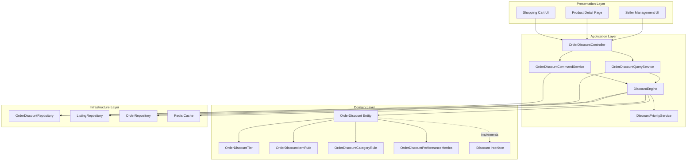

# Design Document: Order Discount System

## Overview

The Order Discount System enables sellers to create automatic discounts that apply to orders without requiring buyers to enter coupon codes. The system supports two primary discount types aligned with eBay's implementation:

1. **Spend-Based Discounts**: Triggered when order subtotal meets a threshold amount
2. **Quantity-Based Discounts**: Triggered when order contains a threshold quantity of items

Key capabilities include multi-tier discount structures, item/category selection and exclusion rules, automatic application in shopping cart, 14-day price change waiting period, and comprehensive discount lifecycle management.

The system integrates with the existing discount infrastructure (IDiscount interface, DiscountType enum) and extends the current OrderDiscount entity to support advanced features like multi-tier discounts, item eligibility rules, and performance tracking.

## Architecture

### System Components



### Component Responsibilities

**DiscountEngine**: Core calculation component that evaluates discount eligibility, calculates discount amounts, applies tier logic, and enforces business rules (price change waiting period, item exclusions).

**DiscountPriorityService**: Resolves conflicts when multiple discounts are eligible by comparing discount amounts and applying priority rules (order discount vs coupon vs sale event).

**OrderDiscountCommandService**: Handles all write operations including create, update, activate, deactivate, and delete operations with validation.

**OrderDiscountQueryService**: Handles all read operations including listing discounts, retrieving discount details, and querying performance metrics.

**OrderDiscount Entity**: Aggregate root managing discount configuration, tiers, item/category rules, and lifecycle state.

### Integration Points

- **Shopping Cart**: Real-time discount evaluation and display
- **Checkout**: Discount revalidation before order finalization
- **Order Processing**: Discount application and tracking
- **Returns Processing**: Discount recalculation for partial returns
- **Listing Management**: Price change tracking for 14-day waiting period
- **Analytics**: Performance metrics aggregation

## Components and Interfaces

### Domain Entities

#### OrderDiscount (Enhanced)

```csharp
public sealed class OrderDiscount : AggregateRoot<Guid>, IDiscount
{
    private readonly List<OrderDiscountTier> _tiers = [];
    private readonly List<OrderDiscountItemRule> _itemRules = [];
    private readonly List<OrderDiscountCategoryRule> _categoryRules = [];
    
    public DiscountType Type => DiscountType.OrderDiscount;
    public UserId SellerId { get; private set; }
    public string Name { get; private set; }
    public string? Description { get; private set; }
    
    // Threshold configuration
    public OrderDiscountThresholdType ThresholdType { get; private set; }
    public decimal? ThresholdAmount { get; private set; }
    public int? ThresholdQuantity { get; private set; }
    
    // Discount configuration
    public decimal DiscountValue { get; private set; }
    public DiscountUnit DiscountUnit { get; private set; }
    public decimal? MaxDiscount { get; private set; }
    
    // Eligibility rules
    public bool ApplyToAllItems { get; private set; }
    
    // Lifecycle
    public DateTime StartDate { get; private set; }
    public DateTime EndDate { get; private set; }
    public bool IsActive { get; private set; }
    
    // Collections
    public IReadOnlyCollection<OrderDiscountTier> Tiers => _tiers.AsReadOnly();
    public IReadOnlyCollection<OrderDiscountItemRule> ItemRules => _itemRules.AsReadOnly();
    public IReadOnlyCollection<OrderDiscountCategoryRule> CategoryRules => _categoryRules.AsReadOnly();
    
    // Factory methods
    public static Result<OrderDiscount> CreateSpendBased(...);
    public static Result<OrderDiscount> CreateQuantityBased(...);
    
    // Tier management
    public Result AddTier(decimal threshold, decimal discountValue);
    public Result RemoveTier(Guid tierId);
    
    // Item/Category rules
    public Result AddItemRule(Guid listingId, bool isExclusion);
    public Result AddCategoryRule(Guid categoryId, bool isExclusion);
    
    // Eligibility evaluation
    public Result<bool> IsItemEligible(Guid listingId, Guid categoryId, DateTime lastPriceChange);
    public Result<DiscountCalculationResult> CalculateDiscount(
        IEnumerable<OrderItem> items, 
        DateTime currentDate);
}
```

#### OrderDiscountTier

```csharp
public sealed class OrderDiscountTier : Entity<Guid>
{
    public Guid OrderDiscountId { get; private set; }
    public decimal ThresholdValue { get; private set; }
    public decimal DiscountValue { get; private set; }
    public int TierOrder { get; private set; }
    
    public static Result<OrderDiscountTier> Create(
        Guid orderDiscountId,
        decimal thresholdValue,
        decimal discountValue,
        int tierOrder);
}
```

#### OrderDiscountItemRule

```csharp
public sealed class OrderDiscountItemRule : Entity<Guid>
{
    public Guid OrderDiscountId { get; private set; }
    public Guid ListingId { get; private set; }
    public bool IsExclusion { get; private set; }
    
    public static Result<OrderDiscountItemRule> Create(
        Guid orderDiscountId,
        Guid listingId,
        bool isExclusion);
}
```

#### OrderDiscountCategoryRule

```csharp
public sealed class OrderDiscountCategoryRule : Entity<Guid>
{
    public Guid OrderDiscountId { get; private set; }
    public Guid CategoryId { get; private set; }
    public bool IsExclusion { get; private set; }
    
    public static Result<OrderDiscountCategoryRule> Create(
        Guid orderDiscountId,
        Guid categoryId,
        bool isExclusion);
}
```

#### OrderDiscountPerformanceMetrics

```csharp
public sealed class OrderDiscountPerformanceMetrics : Entity<Guid>
{
    public Guid OrderDiscountId { get; private set; }
    public int OrderCount { get; private set; }
    public decimal TotalDiscountAmount { get; private set; }
    public decimal TotalSalesRevenue { get; private set; }
    public int TotalItemsSold { get; private set; }
    public DateTime LastUpdated { get; private set; }
    
    public decimal AverageOrderValue => OrderCount > 0 
        ? TotalSalesRevenue / OrderCount 
        : 0;
    
    public void RecordOrder(decimal discountAmount, decimal orderTotal, int itemCount);
    public void AdjustForReturn(decimal discountDifference, decimal orderTotal, int itemCount);
}
```

### Enums

```csharp
public enum OrderDiscountThresholdType
{
    SpendBased = 1,
    QuantityBased = 2
}
```

### Value Objects

#### DiscountCalculationResult

```csharp
public sealed record DiscountCalculationResult(
    Money DiscountAmount,
    OrderDiscountTier? AppliedTier,
    IReadOnlyList<Guid> EligibleItemIds,
    IReadOnlyList<Guid> ExcludedItemIds,
    string? IneligibilityReason);
```

#### OrderItem (for calculation)

```csharp
public sealed record OrderItem(
    Guid ListingId,
    Guid CategoryId,
    Money Price,
    int Quantity,
    DateTime LastPriceChange);
```

### Application Services

#### DiscountEngine

```csharp
public interface IDiscountEngine
{
    Task<Result<DiscountCalculationResult>> EvaluateOrderDiscount(
        OrderDiscount discount,
        IEnumerable<OrderItem> items,
        DateTime currentDate);
    
    Task<Result<AppliedDiscount>> SelectBestDiscount(
        IEnumerable<OrderDiscount> eligibleDiscounts,
        IEnumerable<OrderItem> items);
    
    Task<Result<bool>> ValidateDiscountAtCheckout(
        Guid discountId,
        IEnumerable<OrderItem> items);
}
```

#### OrderDiscountCommandService

```csharp
public interface IOrderDiscountCommandService
{
    Task<Result<Guid>> CreateSpendBasedDiscount(CreateSpendBasedDiscountCommand command);
    Task<Result<Guid>> CreateQuantityBasedDiscount(CreateQuantityBasedDiscountCommand command);
    Task<Result> UpdateDiscount(UpdateOrderDiscountCommand command);
    Task<Result> AddTier(AddDiscountTierCommand command);
    Task<Result> ConfigureItemRules(ConfigureItemRulesCommand command);
    Task<Result> ConfigureCategoryRules(ConfigureCategoryRulesCommand command);
    Task<Result> ActivateDiscount(Guid discountId);
    Task<Result> DeactivateDiscount(Guid discountId);
    Task<Result> DeleteDiscount(Guid discountId);
}
```

#### OrderDiscountQueryService

```csharp
public interface IOrderDiscountQueryService
{
    Task<Result<OrderDiscountDto>> GetById(Guid discountId);
    Task<Result<PagedList<OrderDiscountDto>>> GetBySeller(
        UserId sellerId, 
        int page, 
        int pageSize);
    Task<Result<IEnumerable<OrderDiscountDto>>> GetActiveDiscountsForListing(
        Guid listingId);
    Task<Result<OrderDiscountPerformanceDto>> GetPerformanceMetrics(
        Guid discountId,
        DateTime? startDate,
        DateTime? endDate);
}
```

### Repository Interfaces

```csharp
public interface IOrderDiscountRepository
{
    Task<OrderDiscount?> GetByIdAsync(Guid id, CancellationToken cancellationToken = default);
    Task<IEnumerable<OrderDiscount>> GetBySellerIdAsync(UserId sellerId, CancellationToken cancellationToken = default);
    Task<IEnumerable<OrderDiscount>> GetActiveDiscountsAsync(DateTime currentDate, CancellationToken cancellationToken = default);
    Task<bool> HasBeenAppliedToOrdersAsync(Guid discountId, CancellationToken cancellationToken = default);
    Task AddAsync(OrderDiscount discount, CancellationToken cancellationToken = default);
    Task UpdateAsync(OrderDiscount discount, CancellationToken cancellationToken = default);
    Task DeleteAsync(Guid id, CancellationToken cancellationToken = default);
}
```

## Data Models

### Database Schema

```sql
-- Main discount table
CREATE TABLE OrderDiscounts (
    Id UNIQUEIDENTIFIER PRIMARY KEY,
    SellerId UNIQUEIDENTIFIER NOT NULL,
    Name NVARCHAR(200) NOT NULL,
    Description NVARCHAR(1000),
    ThresholdType INT NOT NULL, -- 1=SpendBased, 2=QuantityBased
    ThresholdAmount DECIMAL(18,2),
    ThresholdQuantity INT,
    DiscountValue DECIMAL(18,2) NOT NULL,
    DiscountUnit INT NOT NULL, -- 1=Percent, 2=FixedAmount
    MaxDiscount DECIMAL(18,2),
    ApplyToAllItems BIT NOT NULL DEFAULT 1,
    StartDate DATETIME2 NOT NULL,
    EndDate DATETIME2 NOT NULL,
    IsActive BIT NOT NULL DEFAULT 1,
    CreatedAt DATETIME2 NOT NULL,
    UpdatedAt DATETIME2,
    CONSTRAINT FK_OrderDiscounts_Sellers FOREIGN KEY (SellerId) REFERENCES Users(Id)
);

-- Tier table for multi-tier discounts
CREATE TABLE OrderDiscountTiers (
    Id UNIQUEIDENTIFIER PRIMARY KEY,
    OrderDiscountId UNIQUEIDENTIFIER NOT NULL,
    ThresholdValue DECIMAL(18,2) NOT NULL,
    DiscountValue DECIMAL(18,2) NOT NULL,
    TierOrder INT NOT NULL,
    CONSTRAINT FK_OrderDiscountTiers_OrderDiscounts FOREIGN KEY (OrderDiscountId) 
        REFERENCES OrderDiscounts(Id) ON DELETE CASCADE
);

-- Item inclusion/exclusion rules
CREATE TABLE OrderDiscountItemRules (
    Id UNIQUEIDENTIFIER PRIMARY KEY,
    OrderDiscountId UNIQUEIDENTIFIER NOT NULL,
    ListingId UNIQUEIDENTIFIER NOT NULL,
    IsExclusion BIT NOT NULL,
    CONSTRAINT FK_OrderDiscountItemRules_OrderDiscounts FOREIGN KEY (OrderDiscountId) 
        REFERENCES OrderDiscounts(Id) ON DELETE CASCADE,
    CONSTRAINT FK_OrderDiscountItemRules_Listings FOREIGN KEY (ListingId) 
        REFERENCES Listings(Id)
);

-- Category inclusion/exclusion rules
CREATE TABLE OrderDiscountCategoryRules (
    Id UNIQUEIDENTIFIER PRIMARY KEY,
    OrderDiscountId UNIQUEIDENTIFIER NOT NULL,
    CategoryId UNIQUEIDENTIFIER NOT NULL,
    IsExclusion BIT NOT NULL,
    CONSTRAINT FK_OrderDiscountCategoryRules_OrderDiscounts FOREIGN KEY (OrderDiscountId) 
        REFERENCES OrderDiscounts(Id) ON DELETE CASCADE,
    CONSTRAINT FK_OrderDiscountCategoryRules_Categories FOREIGN KEY (CategoryId) 
        REFERENCES Categories(Id)
);

-- Performance metrics
CREATE TABLE OrderDiscountPerformanceMetrics (
    Id UNIQUEIDENTIFIER PRIMARY KEY,
    OrderDiscountId UNIQUEIDENTIFIER NOT NULL,
    OrderCount INT NOT NULL DEFAULT 0,
    TotalDiscountAmount DECIMAL(18,2) NOT NULL DEFAULT 0,
    TotalSalesRevenue DECIMAL(18,2) NOT NULL DEFAULT 0,
    TotalItemsSold INT NOT NULL DEFAULT 0,
    LastUpdated DATETIME2 NOT NULL,
    CONSTRAINT FK_OrderDiscountPerformanceMetrics_OrderDiscounts FOREIGN KEY (OrderDiscountId) 
        REFERENCES OrderDiscounts(Id) ON DELETE CASCADE
);

-- Applied discounts tracking
CREATE TABLE AppliedOrderDiscounts (
    Id UNIQUEIDENTIFIER PRIMARY KEY,
    OrderId UNIQUEIDENTIFIER NOT NULL,
    OrderDiscountId UNIQUEIDENTIFIER NOT NULL,
    DiscountAmount DECIMAL(18,2) NOT NULL,
    AppliedTierId UNIQUEIDENTIFIER,
    AppliedAt DATETIME2 NOT NULL,
    CONSTRAINT FK_AppliedOrderDiscounts_Orders FOREIGN KEY (OrderId) 
        REFERENCES Orders(Id),
    CONSTRAINT FK_AppliedOrderDiscounts_OrderDiscounts FOREIGN KEY (OrderDiscountId) 
        REFERENCES OrderDiscounts(Id)
);

-- Indexes
CREATE INDEX IX_OrderDiscounts_SellerId ON OrderDiscounts(SellerId);
CREATE INDEX IX_OrderDiscounts_Active ON OrderDiscounts(IsActive, StartDate, EndDate);
CREATE INDEX IX_OrderDiscountTiers_OrderDiscountId ON OrderDiscountTiers(OrderDiscountId);
CREATE INDEX IX_OrderDiscountItemRules_OrderDiscountId ON OrderDiscountItemRules(OrderDiscountId);
CREATE INDEX IX_OrderDiscountItemRules_ListingId ON OrderDiscountItemRules(ListingId);
CREATE INDEX IX_OrderDiscountCategoryRules_OrderDiscountId ON OrderDiscountCategoryRules(OrderDiscountId);
CREATE INDEX IX_AppliedOrderDiscounts_OrderId ON AppliedOrderDiscounts(OrderId);
CREATE INDEX IX_AppliedOrderDiscounts_OrderDiscountId ON AppliedOrderDiscounts(OrderDiscountId);
```

### DTOs

```csharp
public sealed record OrderDiscountDto(
    Guid Id,
    string Name,
    string? Description,
    OrderDiscountThresholdType ThresholdType,
    decimal? ThresholdAmount,
    int? ThresholdQuantity,
    decimal DiscountValue,
    DiscountUnit DiscountUnit,
    decimal? MaxDiscount,
    bool ApplyToAllItems,
    DateTime StartDate,
    DateTime EndDate,
    bool IsActive,
    IReadOnlyList<OrderDiscountTierDto> Tiers,
    int IncludedItemCount,
    int ExcludedItemCount,
    int IncludedCategoryCount,
    int ExcludedCategoryCount);

public sealed record OrderDiscountTierDto(
    Guid Id,
    decimal ThresholdValue,
    decimal DiscountValue,
    int TierOrder);

public sealed record OrderDiscountPerformanceDto(
    Guid DiscountId,
    string DiscountName,
    int OrderCount,
    decimal TotalDiscountAmount,
    decimal TotalSalesRevenue,
    int TotalItemsSold,
    decimal AverageOrderValue,
    DateTime LastUpdated);
```


## Correctness Properties

*A property is a characteristic or behavior that should hold true across all valid executions of a system—essentially, a formal statement about what the system should do. Properties serve as the bridge between human-readable specifications and machine-verifiable correctness guarantees.*

### Property Reflection

After analyzing all acceptance criteria, the following redundancies were identified and consolidated:

- **Discount value validation (1.3, 1.4, 2.4, 2.5)**: Percentage and fixed amount validation is shared across spend-based and quantity-based discounts. Consolidated into Properties 1 and 2.
- **Optional fields (1.5, 2.6)**: Maximum discount amount is a shared feature. Consolidated into Property 3.
- **Date range validation (1.6, 1.7, 2.7)**: Date validation is shared across discount types. Consolidated into Property 4.
- **Maximum discount capping (7.7, 8.3)**: Same capping logic. Consolidated into Property 15.
- **Price change waiting period (12.2, 12.3)**: Same eligibility filtering from different perspectives. Consolidated into Property 42.

### Property 1: Percentage Discount Value Range

*For any* discount with percentage unit, the discount value must be between 0.01 and 100, and any value outside this range must be rejected.

**Validates: Requirements 1.3, 2.4**

### Property 2: Fixed Amount Discount Value Positivity

*For any* discount with fixed amount unit, the discount value must be greater than 0, and any non-positive value must be rejected.

**Validates: Requirements 1.4, 2.5**

### Property 3: Optional Maximum Discount Acceptance

*For any* discount configuration, the system must accept discounts both with and without a maximum discount amount specified.

**Validates: Requirements 1.5, 2.6**

### Property 4: Date Range Validity

*For any* discount with start and end dates, the end date must be after the start date, and any configuration where end date is before or equal to start date must be rejected.

**Validates: Requirements 1.7**

### Property 5: Default Active Status

*For any* newly created discount, the IsActive property must be true by default.

**Validates: Requirements 1.8**

### Property 6: Required Fields Validation

*For any* discount creation attempt, all required fields (name, threshold value, discount value, discount unit) must be present, and any attempt with missing required fields must be rejected.

**Validates: Requirements 1.2, 2.2**

### Property 7: Threshold Quantity Positivity

*For any* quantity-based discount, the threshold quantity must be a positive integer greater than 0, and any non-positive value must be rejected.

**Validates: Requirements 2.3**

### Property 8: Multi-Tier Support

*For any* discount, the system must accept configurations with 1 to 10 tiers, and reject configurations with more than 10 tiers.

**Validates: Requirements 3.1, 3.5**

### Property 9: Tier Required Fields

*For any* tier creation attempt, both threshold value and discount value must be present, and any attempt with missing fields must be rejected.

**Validates: Requirements 3.2**

### Property 10: Tier Threshold Monotonicity

*For any* sequence of tiers within a discount, each tier must have a higher threshold value than the previous tier, and any non-increasing sequence must be rejected.

**Validates: Requirements 3.3**

### Property 11: Tier Discount Monotonicity

*For any* sequence of tiers within a discount, each tier must have a discount value greater than or equal to the previous tier, and any decreasing sequence must be rejected.

**Validates: Requirements 3.4**

### Property 12: Highest Qualifying Tier Selection

*For any* order and multi-tier discount, the discount engine must apply the tier with the highest threshold that the order qualifies for.

**Validates: Requirements 3.6**

### Property 13: Default Apply To All Items

*For any* discount created without specific item or category rules, the ApplyToAllItems property must be true.

**Validates: Requirements 4.1**

### Property 14: Union Logic for Item and Category Eligibility

*For any* discount with both item and category rules, an item is eligible if it matches either the item rules OR the category rules.

**Validates: Requirements 4.4**

### Property 15: Eligible Items Only Count Toward Threshold

*For any* order and discount with eligibility rules, only eligible items must count toward threshold requirements (both amount and quantity).

**Validates: Requirements 4.6, 5.4, 7.4, 7.6**

### Property 16: Exclusion Precedence

*For any* item that is both included and excluded by discount rules, the item must be treated as excluded.

**Validates: Requirements 5.3**

### Property 17: Excluded Items Not Discounted

*For any* order with excluded items, the discount amount must only reflect eligible items and must not include any discount on excluded items.

**Validates: Requirements 5.5**

### Property 18: Automatic Discount Application

*For any* order that meets discount threshold requirements, the discount must be automatically applied without requiring buyer action.

**Validates: Requirements 6.2**

### Property 19: Active Status Validation

*For any* discount evaluation, only discounts with IsActive = true must be considered for application.

**Validates: Requirements 7.1**

### Property 20: Date Range Validation

*For any* discount evaluation at a given date, the discount must only be applied if the current date is between start date and end date (inclusive).

**Validates: Requirements 7.2**

### Property 21: Fixed Price Items Only

*For any* order, the discount must only be applied to fixed price items (not auction-style items).

**Validates: Requirements 7.3**

### Property 22: Amount Threshold Comparison

*For any* spend-based discount, the order subtotal (of eligible items only) must be compared to the threshold amount to determine eligibility.

**Validates: Requirements 7.5**

### Property 23: Quantity Threshold Comparison

*For any* quantity-based discount, the count of eligible items must be compared to the threshold quantity to determine eligibility.

**Validates: Requirements 7.6**

### Property 24: Maximum Discount Cap

*For any* discount with a maximum discount amount, if the calculated discount exceeds the maximum, the applied discount must equal the maximum discount amount.

**Validates: Requirements 7.7, 8.3**

### Property 25: Percentage Discount Calculation

*For any* discount with percentage unit, the discount amount must equal the order subtotal multiplied by the discount value divided by 100.

**Validates: Requirements 8.1**

### Property 26: Fixed Amount Discount Application

*For any* discount with fixed amount unit, the discount amount must equal the configured discount value (subject to caps).

**Validates: Requirements 8.2**

### Property 27: Discount Cannot Exceed Subtotal

*For any* discount calculation, if the calculated discount exceeds the order subtotal, the applied discount must be capped at the order subtotal.

**Validates: Requirements 8.4**

### Property 28: Discount Rounding

*For any* discount calculation, the final discount amount must be rounded to exactly 2 decimal places.

**Validates: Requirements 8.5**

### Property 29: Non-Negative Discount

*For any* discount calculation, the discount amount must never be negative.

**Validates: Requirements 8.6**

### Property 30: Best Discount Selection

*For any* order with multiple eligible order discounts, the discount that provides the highest discount amount must be applied.

**Validates: Requirements 9.1, 9.2**

### Property 31: Single Order Discount Application

*For any* order, at most one order discount must be applied, even if multiple order discounts are eligible.

**Validates: Requirements 9.3**

### Property 32: Order Discount and Coupon Stacking

*For any* order where both an order discount and a coupon are applicable, both must be allowed to apply.

**Validates: Requirements 9.4**

### Property 33: Order Discount vs Sale Event Priority

*For any* order where both an order discount and a sale event are applicable, only the one with higher discount value must be applied.

**Validates: Requirements 9.5**

### Property 34: Edit Before Start Date

*For any* discount that has not yet started (current date < start date), the seller must be allowed to edit discount details.

**Validates: Requirements 10.2**

### Property 35: Deactivation Effect

*For any* discount that is deactivated, it must immediately stop being applied to new orders.

**Validates: Requirements 10.3, 10.4**

### Property 36: Reactivation Support

*For any* deactivated discount, the seller must be allowed to reactivate it.

**Validates: Requirements 10.5**

### Property 37: Delete Unused Discounts Only

*For any* discount that has not been applied to any orders, deletion must be allowed; for any discount that has been applied to orders, deletion must be prevented.

**Validates: Requirements 10.6, 10.7**

### Property 38: Order Count Tracking

*For any* discount applied to N orders, the performance metrics must show an order count of N.

**Validates: Requirements 11.1**

### Property 39: Total Discount Amount Tracking

*For any* discount applied to multiple orders, the total discount amount in performance metrics must equal the sum of all individual discount amounts applied.

**Validates: Requirements 11.2**

### Property 40: Total Sales Revenue Tracking

*For any* discount applied to multiple orders, the total sales revenue in performance metrics must equal the sum of all order totals (after discount).

**Validates: Requirements 11.3**

### Property 41: Average Order Value Calculation

*For any* discount with performance metrics, the average order value must equal total sales revenue divided by order count.

**Validates: Requirements 11.5**

### Property 42: Price Change Waiting Period

*For any* item with a price change within the past 14 days, the item must be excluded from eligibility for new discounts created after the price change.

**Validates: Requirements 12.2, 12.3**

### Property 43: Existing Discount Grandfathering

*For any* item in an existing active discount, if the item price is changed, the item must remain eligible for that existing discount.

**Validates: Requirements 12.4**

### Property 44: Spend-Based Discount Description Format

*For any* spend-based discount, the display description must follow the format "Save [amount/percentage] when you spend [threshold]".

**Validates: Requirements 13.2**

### Property 45: Quantity-Based Discount Description Format

*For any* quantity-based discount, the display description must follow the format "Save [amount/percentage] when you buy [threshold]+ items".

**Validates: Requirements 13.3**

### Property 46: Highest Tier Display

*For any* multi-tier discount, the product page must display the savings from the highest tier.

**Validates: Requirements 13.4**

### Property 47: Expiration Warning Display

*For any* discount that expires within 7 days, the end date must be displayed; for any discount that expires in more than 7 days, the end date must not be displayed.

**Validates: Requirements 13.5**

### Property 48: Hide Expired and Inactive Discounts

*For any* expired or inactive discount, it must not be displayed to buyers on product pages or search results.

**Validates: Requirements 13.6**

### Property 49: Expired Discount Removal at Checkout

*For any* discount that was valid in cart but has expired by checkout time, the discount must be removed and the buyer must be notified.

**Validates: Requirements 14.2**

### Property 50: Deactivated Discount Removal at Checkout

*For any* discount that was valid in cart but has been deactivated by checkout time, the discount must be removed and the buyer must be notified.

**Validates: Requirements 14.3**

### Property 51: Threshold Change Handling at Checkout

*For any* discount that was applied in cart but the order no longer meets threshold requirements at checkout, the discount must be removed and the buyer must be notified.

**Validates: Requirements 14.4**

### Property 52: Eligibility Change Recalculation

*For any* discount where item eligibility has changed between cart and checkout, the discount amount must be recalculated based on current eligibility.

**Validates: Requirements 14.5**

### Property 53: Return Discount Recalculation

*For any* order with a partial return, the discount eligibility must be recalculated based on the remaining items.

**Validates: Requirements 15.1**

### Property 54: Return Below Threshold Handling

*For any* discounted order where a return causes remaining items to fall below the threshold, the discount must be removed from the order.

**Validates: Requirements 15.2**

### Property 55: Return Tier Adjustment

*For any* discounted order with multi-tier discount where a return causes remaining items to qualify for a lower tier, the discount must be adjusted to the appropriate lower tier.

**Validates: Requirements 15.3**

### Property 56: Return Refund Calculation

*For any* partial return from a discounted order, the refund amount must include the difference in discount amount between the original and adjusted discount.

**Validates: Requirements 15.4**

### Property 57: Return Metrics Update

*For any* partial return from a discounted order, the performance metrics must be updated to reflect the adjusted order count, discount amount, revenue, and item count.

**Validates: Requirements 15.5**

### Property 58: Item Quantity Tracking

*For any* discount applied to orders with various item quantities, the total items sold metric must equal the sum of all item quantities across all orders.

**Validates: Requirements 11.4**

### Property 59: Last Price Change Tracking

*For any* item with a price change, the system must record and store the date of the last price change.

**Validates: Requirements 12.1**


## Error Handling

### Validation Errors

**Discount Creation Validation**:
- `OrderDiscount.EmptyName`: Name is null, empty, or whitespace
- `OrderDiscount.InvalidPercentValue`: Percentage discount value not between 0.01 and 100
- `OrderDiscount.InvalidFixedValue`: Fixed amount discount value is not greater than 0
- `OrderDiscount.InvalidDateRange`: End date is before or equal to start date
- `OrderDiscount.InvalidThresholdAmount`: Threshold amount is not greater than 0
- `OrderDiscount.InvalidThresholdQuantity`: Threshold quantity is not a positive integer
- `OrderDiscount.MissingThreshold`: Neither threshold amount nor threshold quantity is specified
- `OrderDiscount.BothThresholdsSpecified`: Both threshold amount and threshold quantity are specified

**Tier Validation**:
- `OrderDiscountTier.NoTiers`: Attempting to create multi-tier discount with no tiers
- `OrderDiscountTier.TooManyTiers`: Attempting to add more than 10 tiers
- `OrderDiscountTier.InvalidThreshold`: Tier threshold value is not greater than 0
- `OrderDiscountTier.InvalidDiscountValue`: Tier discount value is not greater than 0
- `OrderDiscountTier.NonMonotonicThreshold`: Tier threshold is not higher than previous tier
- `OrderDiscountTier.NonMonotonicDiscount`: Tier discount value is less than previous tier
- `OrderDiscountTier.DuplicateThreshold`: Tier threshold value already exists

**Eligibility Rule Validation**:
- `OrderDiscount.NoEligibleItems`: Discount not applying to all items but no items or categories specified
- `OrderDiscount.ItemNotFound`: Specified listing ID does not exist
- `OrderDiscount.CategoryNotFound`: Specified category ID does not exist
- `OrderDiscount.ItemNotOwnedBySeller`: Specified listing does not belong to the seller
- `OrderDiscount.RecentPriceChange`: Item has price change within past 14 days

**Lifecycle Errors**:
- `OrderDiscount.AlreadyStarted`: Attempting to edit discount after start date
- `OrderDiscount.AlreadyActive`: Attempting to activate an already active discount
- `OrderDiscount.AlreadyInactive`: Attempting to deactivate an already inactive discount
- `OrderDiscount.HasBeenApplied`: Attempting to delete discount that has been applied to orders
- `OrderDiscount.NotFound`: Discount ID does not exist

### Business Logic Errors

**Discount Application**:
- `DiscountEngine.DiscountExpired`: Discount end date has passed
- `DiscountEngine.DiscountNotStarted`: Current date is before discount start date
- `DiscountEngine.DiscountInactive`: Discount is not active
- `DiscountEngine.ThresholdNotMet`: Order does not meet minimum threshold requirements
- `DiscountEngine.NoEligibleItems`: Order contains no items eligible for the discount
- `DiscountEngine.AuctionItemsPresent`: Order contains auction-style items (not fixed price)
- `DiscountEngine.SellerMismatch`: Order items are not from the discount seller

**Checkout Validation**:
- `DiscountEngine.DiscountExpiredAtCheckout`: Discount expired between cart and checkout
- `DiscountEngine.DiscountDeactivatedAtCheckout`: Discount was deactivated between cart and checkout
- `DiscountEngine.ThresholdNoLongerMet`: Order no longer meets threshold at checkout
- `DiscountEngine.EligibilityChanged`: Item eligibility changed between cart and checkout

**Return Processing**:
- `OrderDiscount.InvalidReturnAmount`: Return amount exceeds original order amount
- `OrderDiscount.DiscountAdjustmentFailed`: Failed to recalculate discount after return

### Error Response Format

All errors follow the Result pattern with structured error information:

```csharp
public sealed record Error(string Code, string Message, ErrorType Type)
{
    public static Error Validation(string code, string message) 
        => new(code, message, ErrorType.Validation);
    
    public static Error NotFound(string code, string message) 
        => new(code, message, ErrorType.NotFound);
    
    public static Error Conflict(string code, string message) 
        => new(code, message, ErrorType.Conflict);
    
    public static Error Failure(string code, string message) 
        => new(code, message, ErrorType.Failure);
}
```

### Logging Strategy

**Audit Logging**:
- Discount creation, update, activation, deactivation, deletion
- Tier additions and removals
- Item/category rule changes
- Discount applications to orders
- Discount removals at checkout
- Return adjustments

**Performance Logging**:
- Discount evaluation duration
- Cache hit/miss rates
- Database query performance
- Bulk eligibility checks

**Error Logging**:
- All validation failures with context
- Business rule violations
- Unexpected exceptions during discount calculation
- Checkout revalidation failures

## Testing Strategy

### Dual Testing Approach

The Order Discount System requires both unit testing and property-based testing for comprehensive coverage:

**Unit Tests**: Focus on specific examples, edge cases, and integration points
**Property Tests**: Verify universal properties across all inputs through randomization

Both approaches are complementary and necessary. Unit tests catch concrete bugs in specific scenarios, while property tests verify general correctness across a wide range of inputs.

### Property-Based Testing

**Framework**: Use **FsCheck** for C#/.NET property-based testing

**Configuration**:
- Minimum 100 iterations per property test (due to randomization)
- Each property test must reference its design document property
- Tag format: `// Feature: order-discount, Property {number}: {property_text}`

**Generator Strategy**:

```csharp
// Example generators for property tests
public static class OrderDiscountGenerators
{
    // Generate valid discount configurations
    public static Arbitrary<ValidDiscountConfig> ValidDiscountConfig() =>
        Arb.From(
            from name in Arb.Generate<NonEmptyString>()
            from discountValue in Gen.Choose(1, 100).Select(x => (decimal)x)
            from unit in Gen.Elements(DiscountUnit.Percent, DiscountUnit.FixedAmount)
            from thresholdAmount in Gen.Choose(10, 1000).Select(x => (decimal)x)
            from startDate in Arb.Generate<DateTime>()
            from duration in Gen.Choose(1, 365)
            select new ValidDiscountConfig(
                name.Get,
                discountValue,
                unit,
                thresholdAmount,
                startDate,
                startDate.AddDays(duration)));
    
    // Generate order items with various configurations
    public static Arbitrary<OrderItem> OrderItem() =>
        Arb.From(
            from price in Gen.Choose(1, 1000).Select(x => Money.Create(x, "USD"))
            from quantity in Gen.Choose(1, 10)
            from lastPriceChange in Arb.Generate<DateTime>()
            select new OrderItem(
                Guid.NewGuid(),
                Guid.NewGuid(),
                price.Value,
                quantity,
                lastPriceChange));
    
    // Generate multi-tier configurations
    public static Arbitrary<List<TierDefinition>> TierDefinitions() =>
        Arb.From(
            from tierCount in Gen.Choose(1, 10)
            from tiers in Gen.ListOf(tierCount, 
                from threshold in Gen.Choose(10, 1000).Select(x => (decimal)x)
                from discount in Gen.Choose(5, 50).Select(x => (decimal)x)
                select new TierDefinition(threshold, discount))
            select tiers.OrderBy(t => t.Threshold).ToList());
}
```

**Property Test Examples**:

```csharp
[Property]
// Feature: order-discount, Property 1: Percentage Discount Value Range
public Property PercentageDiscountValueMustBeInRange()
{
    return Prop.ForAll(
        Arb.Generate<decimal>().ToArbitrary(),
        discountValue =>
        {
            var result = OrderDiscount.CreateSpendBased(
                sellerId: UserId.Create(Guid.NewGuid()),
                name: "Test Discount",
                description: null,
                discountValue: discountValue,
                discountUnit: DiscountUnit.Percent,
                thresholdAmount: 50m,
                maxDiscount: null,
                startDate: DateTime.UtcNow,
                endDate: DateTime.UtcNow.AddDays(30));
            
            if (discountValue >= 0.01m && discountValue <= 100m)
                return result.IsSuccess;
            else
                return result.IsFailure && 
                       result.Error.Code == "OrderDiscount.InvalidPercentValue";
        });
}

[Property]
// Feature: order-discount, Property 12: Highest Qualifying Tier Selection
public Property HighestQualifyingTierIsSelected()
{
    return Prop.ForAll(
        OrderDiscountGenerators.TierDefinitions(),
        Gen.Choose(0, 2000).Select(x => Money.Create(x, "USD")).ToArbitrary(),
        (tiers, orderTotal) =>
        {
            var discount = CreateDiscountWithTiers(tiers);
            var result = discount.CalculateDiscount(
                new[] { new OrderItem(Guid.NewGuid(), Guid.NewGuid(), orderTotal.Value, 1, DateTime.UtcNow.AddDays(-30)) },
                DateTime.UtcNow);
            
            if (result.IsSuccess && result.Value.AppliedTier != null)
            {
                var qualifyingTiers = tiers.Where(t => orderTotal.Value.Amount >= t.Threshold).ToList();
                if (qualifyingTiers.Any())
                {
                    var expectedTier = qualifyingTiers.OrderByDescending(t => t.Threshold).First();
                    return result.Value.AppliedTier.ThresholdValue == expectedTier.Threshold;
                }
            }
            return true;
        });
}

[Property]
// Feature: order-discount, Property 27: Discount Cannot Exceed Subtotal
public Property DiscountCannotExceedSubtotal()
{
    return Prop.ForAll(
        OrderDiscountGenerators.ValidDiscountConfig(),
        OrderDiscountGenerators.OrderItem(),
        (config, item) =>
        {
            var discount = CreateDiscount(config);
            var result = discount.CalculateDiscount(new[] { item }, DateTime.UtcNow);
            
            if (result.IsSuccess)
            {
                var orderSubtotal = item.Price.Amount * item.Quantity;
                return result.Value.DiscountAmount.Amount <= orderSubtotal;
            }
            return true;
        });
}
```

### Unit Testing

**Focus Areas**:

1. **Specific Examples**: Test concrete scenarios with known inputs and outputs
   - Creating a spend-based discount with $50 threshold and 10% off
   - Applying a 3-tier discount to an order of $75
   - Excluding specific items from a discount

2. **Edge Cases**: Test boundary conditions
   - Order subtotal exactly equals threshold
   - Discount percentage of exactly 100%
   - Price change exactly 14 days ago
   - Discount expiring at midnight
   - Empty cart evaluation
   - Single item orders

3. **Integration Points**: Test component interactions
   - Discount engine with repository
   - Shopping cart with discount engine
   - Checkout validation with discount revalidation
   - Return processing with metrics update

4. **Error Conditions**: Test failure scenarios
   - Creating discount with invalid data
   - Applying expired discount
   - Deleting discount that has been used
   - Editing discount after start date

**Unit Test Examples**:

```csharp
[Fact]
public async Task CreateSpendBasedDiscount_WithValidData_ReturnsSuccess()
{
    // Arrange
    var sellerId = UserId.Create(Guid.NewGuid());
    var name = "Summer Sale";
    var thresholdAmount = 50m;
    var discountValue = 10m;
    var unit = DiscountUnit.Percent;
    var startDate = DateTime.UtcNow;
    var endDate = startDate.AddDays(30);
    
    // Act
    var result = OrderDiscount.CreateSpendBased(
        sellerId, name, null, discountValue, unit, null, thresholdAmount, startDate, endDate);
    
    // Assert
    Assert.True(result.IsSuccess);
    Assert.Equal(name, result.Value.Name);
    Assert.Equal(thresholdAmount, result.Value.ThresholdAmount);
    Assert.True(result.Value.IsActive);
}

[Fact]
public async Task CalculateDiscount_OrderExactlyAtThreshold_AppliesDiscount()
{
    // Arrange
    var discount = CreateTestDiscount(thresholdAmount: 100m, discountValue: 10m, unit: DiscountUnit.Percent);
    var items = new[] { CreateOrderItem(price: 100m, quantity: 1) };
    
    // Act
    var result = discount.CalculateDiscount(items, DateTime.UtcNow);
    
    // Assert
    Assert.True(result.IsSuccess);
    Assert.Equal(10m, result.Value.DiscountAmount.Amount);
}

[Fact]
public async Task ApplyDiscount_WithExcludedItem_DoesNotDiscountExcludedItem()
{
    // Arrange
    var discount = CreateTestDiscount();
    var includedItemId = Guid.NewGuid();
    var excludedItemId = Guid.NewGuid();
    discount.AddItemRule(excludedItemId, isExclusion: true);
    
    var items = new[]
    {
        CreateOrderItem(listingId: includedItemId, price: 50m),
        CreateOrderItem(listingId: excludedItemId, price: 50m)
    };
    
    // Act
    var result = discount.CalculateDiscount(items, DateTime.UtcNow);
    
    // Assert
    Assert.True(result.IsSuccess);
    Assert.Single(result.Value.EligibleItemIds);
    Assert.Contains(includedItemId, result.Value.EligibleItemIds);
    Assert.Contains(excludedItemId, result.Value.ExcludedItemIds);
}

[Fact]
public async Task DeleteDiscount_ThatHasBeenApplied_ReturnsFailure()
{
    // Arrange
    var discount = CreateTestDiscount();
    var discountId = discount.Id;
    await _repository.AddAsync(discount);
    await ApplyDiscountToOrder(discountId);
    
    // Act
    var result = await _commandService.DeleteDiscount(discountId);
    
    // Assert
    Assert.True(result.IsFailure);
    Assert.Equal("OrderDiscount.HasBeenApplied", result.Error.Code);
}
```

### Test Coverage Goals

- **Line Coverage**: Minimum 85%
- **Branch Coverage**: Minimum 80%
- **Property Tests**: All 59 correctness properties must have corresponding property tests
- **Unit Tests**: Minimum 100 unit tests covering examples, edge cases, and integration points

### Testing Tools

- **Unit Testing**: xUnit
- **Property-Based Testing**: FsCheck
- **Mocking**: NSubstitute
- **Test Data Builders**: Custom builders for domain entities
- **Integration Testing**: WebApplicationFactory for API tests

### Continuous Integration

- All tests must pass before merge
- Property tests run with 100 iterations in CI
- Performance tests for discount evaluation (target: <50ms for single discount evaluation)
- Load tests for bulk discount evaluation (target: 1000 evaluations/second)

