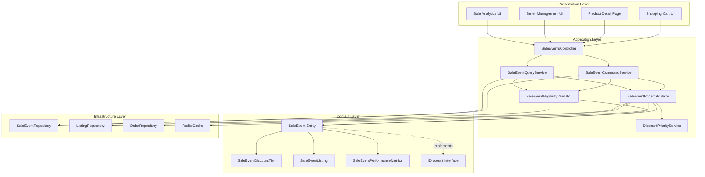

# Design Document: Sale Event System

## Overview

The Sale Event System enables sellers to run time-limited promotional sales on selected items with tiered discount structures. The system supports two highlight modes aligned with eBay's implementation:

1. **Discount Tiers Mode (DiscountAndSaleEvent)**: Applies tiered markdown discounts to assigned listings with multiple priority levels
2. **Highlight Only Mode (SaleEventOnly)**: Displays strike-through pricing without applying tiered discounts

Key capabilities include multi-tier discount structures with priority-based assignment, flexible listing assignment to tiers, sale options (free shipping, price increase blocking), automatic sale price calculation, real-time eligibility validation, performance tracking and analytics, and comprehensive lifecycle management (draft, scheduled, active, ended, cancelled).

The system integrates with the existing discount infrastructure (IDiscount interface, DiscountType enum) and extends the current SaleEvent entity to support advanced features like discount calculation, eligibility validation, checkout revalidation, and return handling.

## Architecture

### System Components



### Component Responsibilities

**SaleEventPriceCalculator**: Core calculation component that computes sale prices based on tier assignments, applies discount calculations (percentage off or fixed amount off), enforces maximum discount caps, handles rounding to 2 decimal places, and validates non-negative pricing.

**SaleEventEligibilityValidator**: Validates sale event eligibility by checking active status, date range validity, listing assignment to tiers, seller ownership, listing type (fixed price only), and listing status (active and published).

**DiscountPriorityService**: Resolves conflicts when multiple discounts are eligible by comparing discount amounts and applying priority rules (sale event vs order discount vs coupon).

**SaleEventCommandService**: Handles all write operations including create, update, activate, deactivate, delete, tier management, and listing assignments with validation.

**SaleEventQueryService**: Handles all read operations including listing sale events, retrieving sale event details, querying eligible listings, and fetching performance metrics.

**SaleEvent Entity**: Aggregate root managing sale event configuration, discount tiers, listing assignments, sale options, and lifecycle state.

### Integration Points

- **Shopping Cart**: Real-time sale price display and calculation
- **Product Detail Page**: Sale event information display (badges, pricing, end dates)
- **Checkout**: Sale event revalidation before order finalization
- **Order Processing**: Sale event application tracking and performance metrics
- **Returns Processing**: Sale price refund calculation for partial returns
- **Listing Management**: Price change tracking for price increase blocking
- **Analytics**: Performance metrics aggregation and reporting

## Components and Interfaces

### Domain Entities

#### SaleEvent (Enhanced)

```csharp
public sealed class SaleEvent : AggregateRoot<Guid>, IDiscount
{
    private readonly List<SaleEventDiscountTier> _discountTiers = [];
    private readonly List<SaleEventListing> _listings = [];
    
    public DiscountType Type => DiscountType.SaleEvent;
    public UserId SellerId { get; private set; }
    public string Name { get; private set; }
    public string? Description { get; private set; }
    public string? BuyerMessageLabel { get; private set; }
    
    // Mode configuration
    public SaleEventMode Mode { get; private set; }
    public decimal? HighlightPercentage { get; private set; }
    
    // Sale options
    public bool OfferFreeShipping { get; private set; }
    public bool BlockPriceIncreaseRevisions { get; private set; }
    public bool IncludeSkippedItems { get; private set; }
    
    // Lifecycle
    public DateTime StartDate { get; private set; }
    public DateTime EndDate { get; private set; }
    public SaleEventStatus Status { get; private set; }
    
    // Collections
    public IReadOnlyCollection<SaleEventDiscountTier> DiscountTiers => _discountTiers.AsReadOnly();
    public IReadOnlyCollection<SaleEventListing> Listings => _listings.AsReadOnly();
    
    // Factory methods
    public static Result<SaleEvent> Create(
        UserId sellerId,
        string name,
        string? description,
        string? buyerMessageLabel,
        SaleEventMode mode,
        DateTime startDate,
        DateTime endDate,
        bool offerFreeShipping,
        bool blockPriceIncreaseRevisions,
        bool includeSkippedItems,
        decimal? highlightPercentage,
        IEnumerable<SaleEventDiscountTierDefinition>? tierDefinitions);
    
    // Update methods
    public Result Update(
        string name,
        string? description,
        string? buyerMessageLabel,
        SaleEventMode mode,
        DateTime startDate,
        DateTime endDate,
        bool offerFreeShipping,
        bool blockPriceIncreaseRevisions,
        bool includeSkippedItems,
        decimal? highlightPercentage,
        IEnumerable<SaleEventDiscountTierDefinition>? tierDefinitions,
        DateTime utcNow);
    
    // Status management
    public Result Activate(DateTime utcNow);
    public Result Deactivate(DateTime utcNow);
    public Result UpdateStatus(SaleEventStatus newStatus, DateTime utcNow);
    
    // Tier management
    public Result AddTier(
        SaleEventDiscountType discountType,
        decimal discountValue,
        int priority,
        string? label,
        IEnumerable<Guid> listingIds);
    public Result RemoveTier(Guid tierId);
    public Result UpdateTierPriority(Guid tierId, int newPriority);
    
    // Listing assignment
    public Result AssignListingToTier(Guid listingId, Guid tierId);
    public Result RemoveListingAssignment(Guid listingId);
    public Result ReassignListing(Guid listingId, Guid newTierId);
    public Result BulkAssignListings(IEnumerable<Guid> listingIds, Guid tierId);
    
    // Price calculation
    public Result<Money> CalculateSalePrice(
        Money originalPrice,
        Guid listingId,
        DateTime currentDate);
    
    // Eligibility validation
    public Result<bool> IsListingEligible(
        Guid listingId,
        bool isFixedPrice,
        bool isActive,
        DateTime currentDate);
    
    // IDiscount implementation
    public Result<Money> CalculateDiscount(Money orderTotal, int itemCount);
    public bool IsApplicable(DateTime currentDate);
}
```

#### SaleEventDiscountTier (Enhanced)

```csharp
public sealed class SaleEventDiscountTier : Entity<Guid>
{
    private readonly List<SaleEventListing> _listings = [];
    
    public Guid SaleEventId { get; private set; }
    public SaleEventDiscountType DiscountType { get; private set; }
    public decimal DiscountValue { get; private set; }
    public int Priority { get; private set; }
    public string? Label { get; private set; }
    
    public IReadOnlyCollection<SaleEventListing> Listings => _listings.AsReadOnly();
    
    public static Result<SaleEventDiscountTier> Create(
        Guid saleEventId,
        SaleEventDiscountType discountType,
        decimal discountValue,
        int priority,
        string? label);
    
    public Result AddListing(SaleEventListing listing);
    public Result RemoveListing(Guid listingId);
    public void ClearListings();
    public Result UpdatePriority(int newPriority);
}
```

#### SaleEventListing

```csharp
public sealed class SaleEventListing : Entity<Guid>
{
    public Guid SaleEventId { get; private set; }
    public Guid DiscountTierId { get; private set; }
    public Guid ListingId { get; private set; }
    public DateTime AssignedAt { get; private set; }
    
    public static Result<SaleEventListing> Create(
        Guid saleEventId,
        Guid discountTierId,
        Guid listingId);
}
```

#### SaleEventPerformanceMetrics

```csharp
public sealed class SaleEventPerformanceMetrics : Entity<Guid>
{
    public Guid SaleEventId { get; private set; }
    public int OrderCount { get; private set; }
    public decimal TotalDiscountAmount { get; private set; }
    public decimal TotalSalesRevenue { get; private set; }
    public int TotalItemsSold { get; private set; }
    public DateTime LastUpdated { get; private set; }
    
    public decimal AverageDiscountPerOrder => OrderCount > 0 
        ? TotalDiscountAmount / OrderCount 
        : 0;
    
    public decimal AverageOrderValue => OrderCount > 0 
        ? TotalSalesRevenue / OrderCount 
        : 0;
    
    public void RecordOrder(decimal discountAmount, decimal orderTotal, int itemCount);
    public void AdjustForReturn(decimal discountDifference, decimal orderTotal, int itemCount);
}
```

#### SaleEventPriceSnapshot

```csharp
public sealed class SaleEventPriceSnapshot : Entity<Guid>
{
    public Guid SaleEventId { get; private set; }
    public Guid ListingId { get; private set; }
    public decimal OriginalPrice { get; private set; }
    public DateTime SnapshotAt { get; private set; }
    
    public static Result<SaleEventPriceSnapshot> Create(
        Guid saleEventId,
        Guid listingId,
        decimal originalPrice,
        DateTime snapshotAt);
}
```

### Enums

```csharp
public enum SaleEventMode
{
    DiscountAndSaleEvent = 1,  // Discount tiers mode
    SaleEventOnly = 2           // Highlight only mode
}

public enum SaleEventStatus
{
    Draft = 1,
    Scheduled = 2,
    Active = 3,
    Ended = 4,
    Cancelled = 5
}

public enum SaleEventDiscountType
{
    Percent = 1,
    Amount = 2
}
```

### Value Objects

#### SaleEventDiscountTierDefinition

```csharp
public sealed record SaleEventDiscountTierDefinition(
    SaleEventDiscountType DiscountType,
    decimal DiscountValue,
    int Priority,
    string? Label,
    IReadOnlyList<Guid> ListingIds);
```

#### SalePriceCalculationResult

```csharp
public sealed record SalePriceCalculationResult(
    Money SalePrice,
    Money OriginalPrice,
    Money DiscountAmount,
    SaleEventDiscountTier? AppliedTier,
    string? IneligibilityReason);
```

### Application Services

#### SaleEventPriceCalculator

```csharp
public interface ISaleEventPriceCalculator
{
    Task<Result<SalePriceCalculationResult>> CalculateSalePrice(
        SaleEvent saleEvent,
        Guid listingId,
        Money originalPrice,
        DateTime currentDate);
    
    Task<Result<Money>> CalculateDiscountAmount(
        SaleEventDiscountType discountType,
        decimal discountValue,
        Money originalPrice);
    
    Task<Result<IReadOnlyList<SalePriceCalculationResult>>> CalculateBulkSalePrices(
        SaleEvent saleEvent,
        IEnumerable<(Guid ListingId, Money OriginalPrice)> listings,
        DateTime currentDate);
}
```

#### SaleEventEligibilityValidator

```csharp
public interface ISaleEventEligibilityValidator
{
    Task<Result<bool>> ValidateListingEligibility(
        Guid listingId,
        UserId sellerId);
    
    Task<Result<bool>> ValidateSaleEventEligibility(
        SaleEvent saleEvent,
        DateTime currentDate);
    
    Task<Result<bool>> ValidateListingForTierAssignment(
        Guid listingId,
        Guid saleEventId,
        UserId sellerId);
    
    Task<Result<IReadOnlyList<Guid>>> GetEligibleListings(
        UserId sellerId,
        string? searchTerm,
        Guid? categoryId,
        decimal? minPrice,
        decimal? maxPrice);
}
```

#### SaleEventCommandService

```csharp
public interface ISaleEventCommandService
{
    Task<Result<Guid>> CreateSaleEvent(CreateSaleEventCommand command);
    Task<Result> UpdateSaleEvent(UpdateSaleEventCommand command);
    Task<Result> UpdateStatus(Guid saleEventId, SaleEventStatus status);
    Task<Result> ActivateSaleEvent(Guid saleEventId);
    Task<Result> DeactivateSaleEvent(Guid saleEventId);
    Task<Result> DeleteSaleEvent(Guid saleEventId);
    Task<Result> AssignListingsToTier(AssignListingsToTierCommand command);
    Task<Result> RemoveListingAssignment(Guid saleEventId, Guid listingId);
    Task<Result> ReassignListing(Guid saleEventId, Guid listingId, Guid newTierId);
    Task<Result> UpdateTierPriority(Guid saleEventId, Guid tierId, int newPriority);
}
```

#### SaleEventQueryService

```csharp
public interface ISaleEventQueryService
{
    Task<Result<SaleEventDto>> GetById(Guid saleEventId);
    Task<Result<PagedList<SaleEventDto>>> GetBySeller(
        UserId sellerId,
        int page,
        int pageSize);
    Task<Result<IEnumerable<SaleEventDto>>> GetActiveSaleEventsForListing(
        Guid listingId);
    Task<Result<SaleEventPerformanceDto>> GetPerformanceMetrics(
        Guid saleEventId,
        DateTime? startDate,
        DateTime? endDate);
    Task<Result<PagedList<ListingDto>>> GetEligibleListings(
        UserId sellerId,
        string? searchTerm,
        Guid? categoryId,
        decimal? minPrice,
        decimal? maxPrice,
        int page,
        int pageSize);
}
```

### Repository Interfaces

```csharp
public interface ISaleEventRepository
{
    Task<SaleEvent?> GetByIdAsync(Guid id, CancellationToken cancellationToken = default);
    Task<IEnumerable<SaleEvent>> GetBySellerIdAsync(UserId sellerId, CancellationToken cancellationToken = default);
    Task<IEnumerable<SaleEvent>> GetActiveSaleEventsAsync(DateTime currentDate, CancellationToken cancellationToken = default);
    Task<IEnumerable<SaleEvent>> GetActiveSaleEventsForListingAsync(Guid listingId, DateTime currentDate, CancellationToken cancellationToken = default);
    Task<bool> HasBeenAppliedToOrdersAsync(Guid saleEventId, CancellationToken cancellationToken = default);
    Task<SaleEventPriceSnapshot?> GetPriceSnapshotAsync(Guid saleEventId, Guid listingId, CancellationToken cancellationToken = default);
    Task AddAsync(SaleEvent saleEvent, CancellationToken cancellationToken = default);
    Task UpdateAsync(SaleEvent saleEvent, CancellationToken cancellationToken = default);
    Task DeleteAsync(Guid id, CancellationToken cancellationToken = default);
    Task AddPriceSnapshotAsync(SaleEventPriceSnapshot snapshot, CancellationToken cancellationToken = default);
}
```

## Data Models

### Database Schema

```sql
-- Main sale event table
CREATE TABLE SaleEvents (
    Id UNIQUEIDENTIFIER PRIMARY KEY,
    SellerId UNIQUEIDENTIFIER NOT NULL,
    Name NVARCHAR(200) NOT NULL,
    Description NVARCHAR(1000),
    BuyerMessageLabel NVARCHAR(100),
    Mode INT NOT NULL, -- 1=DiscountAndSaleEvent, 2=SaleEventOnly
    Status INT NOT NULL, -- 1=Draft, 2=Scheduled, 3=Active, 4=Ended, 5=Cancelled
    StartDate DATETIME2 NOT NULL,
    EndDate DATETIME2 NOT NULL,
    OfferFreeShipping BIT NOT NULL DEFAULT 0,
    BlockPriceIncreaseRevisions BIT NOT NULL DEFAULT 0,
    IncludeSkippedItems BIT NOT NULL DEFAULT 0,
    HighlightPercentage DECIMAL(5,2),
    CreatedAt DATETIME2 NOT NULL,
    UpdatedAt DATETIME2,
    CreatedBy NVARCHAR(450),
    UpdatedBy NVARCHAR(450),
    CONSTRAINT FK_SaleEvents_Sellers FOREIGN KEY (SellerId) REFERENCES Users(Id)
);

-- Discount tier table
CREATE TABLE SaleEventDiscountTiers (
    Id UNIQUEIDENTIFIER PRIMARY KEY,
    SaleEventId UNIQUEIDENTIFIER NOT NULL,
    DiscountType INT NOT NULL, -- 1=Percent, 2=Amount
    DiscountValue DECIMAL(18,2) NOT NULL,
    Priority INT NOT NULL,
    Label NVARCHAR(100),
    CONSTRAINT FK_SaleEventDiscountTiers_SaleEvents FOREIGN KEY (SaleEventId) 
        REFERENCES SaleEvents(Id) ON DELETE CASCADE,
    CONSTRAINT UQ_SaleEventDiscountTiers_Priority UNIQUE (SaleEventId, Priority)
);

-- Listing assignment table
CREATE TABLE SaleEventListings (
    Id UNIQUEIDENTIFIER PRIMARY KEY,
    SaleEventId UNIQUEIDENTIFIER NOT NULL,
    DiscountTierId UNIQUEIDENTIFIER NOT NULL,
    ListingId UNIQUEIDENTIFIER NOT NULL,
    AssignedAt DATETIME2 NOT NULL,
    CONSTRAINT FK_SaleEventListings_SaleEvents FOREIGN KEY (SaleEventId) 
        REFERENCES SaleEvents(Id) ON DELETE CASCADE,
    CONSTRAINT FK_SaleEventListings_DiscountTiers FOREIGN KEY (DiscountTierId) 
        REFERENCES SaleEventDiscountTiers(Id),
    CONSTRAINT FK_SaleEventListings_Listings FOREIGN KEY (ListingId) 
        REFERENCES Listings(Id),
    CONSTRAINT UQ_SaleEventListings_Listing UNIQUE (SaleEventId, ListingId)
);

-- Performance metrics table
CREATE TABLE SaleEventPerformanceMetrics (
    Id UNIQUEIDENTIFIER PRIMARY KEY,
    SaleEventId UNIQUEIDENTIFIER NOT NULL,
    OrderCount INT NOT NULL DEFAULT 0,
    TotalDiscountAmount DECIMAL(18,2) NOT NULL DEFAULT 0,
    TotalSalesRevenue DECIMAL(18,2) NOT NULL DEFAULT 0,
    TotalItemsSold INT NOT NULL DEFAULT 0,
    LastUpdated DATETIME2 NOT NULL,
    CONSTRAINT FK_SaleEventPerformanceMetrics_SaleEvents FOREIGN KEY (SaleEventId) 
        REFERENCES SaleEvents(Id) ON DELETE CASCADE
);

-- Price snapshot table for price increase blocking
CREATE TABLE SaleEventPriceSnapshots (
    Id UNIQUEIDENTIFIER PRIMARY KEY,
    SaleEventId UNIQUEIDENTIFIER NOT NULL,
    ListingId UNIQUEIDENTIFIER NOT NULL,
    OriginalPrice DECIMAL(18,2) NOT NULL,
    SnapshotAt DATETIME2 NOT NULL,
    CONSTRAINT FK_SaleEventPriceSnapshots_SaleEvents FOREIGN KEY (SaleEventId) 
        REFERENCES SaleEvents(Id) ON DELETE CASCADE,
    CONSTRAINT FK_SaleEventPriceSnapshots_Listings FOREIGN KEY (ListingId) 
        REFERENCES Listings(Id),
    CONSTRAINT UQ_SaleEventPriceSnapshots_Listing UNIQUE (SaleEventId, ListingId)
);

-- Applied sale events tracking
CREATE TABLE AppliedSaleEvents (
    Id UNIQUEIDENTIFIER PRIMARY KEY,
    OrderId UNIQUEIDENTIFIER NOT NULL,
    SaleEventId UNIQUEIDENTIFIER NOT NULL,
    DiscountTierId UNIQUEIDENTIFIER NOT NULL,
    ListingId UNIQUEIDENTIFIER NOT NULL,
    OriginalPrice DECIMAL(18,2) NOT NULL,
    SalePrice DECIMAL(18,2) NOT NULL,
    DiscountAmount DECIMAL(18,2) NOT NULL,
    AppliedAt DATETIME2 NOT NULL,
    CONSTRAINT FK_AppliedSaleEvents_Orders FOREIGN KEY (OrderId) 
        REFERENCES Orders(Id),
    CONSTRAINT FK_AppliedSaleEvents_SaleEvents FOREIGN KEY (SaleEventId) 
        REFERENCES SaleEvents(Id),
    CONSTRAINT FK_AppliedSaleEvents_DiscountTiers FOREIGN KEY (DiscountTierId) 
        REFERENCES SaleEventDiscountTiers(Id)
);

-- Indexes
CREATE INDEX IX_SaleEvents_SellerId ON SaleEvents(SellerId);
CREATE INDEX IX_SaleEvents_Status ON SaleEvents(Status, StartDate, EndDate);
CREATE INDEX IX_SaleEvents_Active ON SaleEvents(Status) WHERE Status = 3;
CREATE INDEX IX_SaleEventDiscountTiers_SaleEventId ON SaleEventDiscountTiers(SaleEventId);
CREATE INDEX IX_SaleEventListings_SaleEventId ON SaleEventListings(SaleEventId);
CREATE INDEX IX_SaleEventListings_ListingId ON SaleEventListings(ListingId);
CREATE INDEX IX_SaleEventListings_DiscountTierId ON SaleEventListings(DiscountTierId);
CREATE INDEX IX_AppliedSaleEvents_OrderId ON AppliedSaleEvents(OrderId);
CREATE INDEX IX_AppliedSaleEvents_SaleEventId ON AppliedSaleEvents(SaleEventId);
CREATE INDEX IX_SaleEventPriceSnapshots_SaleEventId ON SaleEventPriceSnapshots(SaleEventId);
CREATE INDEX IX_SaleEventPriceSnapshots_ListingId ON SaleEventPriceSnapshots(ListingId);
```

### DTOs

```csharp
public sealed record SaleEventDto(
    Guid Id,
    string Name,
    string? Description,
    string? BuyerMessageLabel,
    SaleEventMode Mode,
    SaleEventStatus Status,
    DateTime StartDate,
    DateTime EndDate,
    bool OfferFreeShipping,
    bool BlockPriceIncreaseRevisions,
    bool IncludeSkippedItems,
    decimal? HighlightPercentage,
    IReadOnlyList<SaleEventDiscountTierDto> DiscountTiers,
    int TotalListingsCount);

public sealed record SaleEventDiscountTierDto(
    Guid Id,
    SaleEventDiscountType DiscountType,
    decimal DiscountValue,
    int Priority,
    string? Label,
    int ListingCount);

public sealed record SaleEventPerformanceDto(
    Guid SaleEventId,
    string SaleEventName,
    int OrderCount,
    decimal TotalDiscountAmount,
    decimal TotalSalesRevenue,
    int TotalItemsSold,
    decimal AverageDiscountPerOrder,
    decimal AverageOrderValue,
    DateTime LastUpdated,
    IReadOnlyList<TierPerformanceDto> TierPerformance);

public sealed record TierPerformanceDto(
    Guid TierId,
    string? TierLabel,
    int Priority,
    int OrderCount,
    decimal TotalDiscountAmount,
    decimal TotalSalesRevenue);

public sealed record ListingDto(
    Guid Id,
    string Title,
    decimal Price,
    string Currency,
    Guid CategoryId,
    string CategoryName,
    bool IsActive,
    DateTime CreatedAt);
```


## Correctness Properties

*A property is a characteristic or behavior that should hold true across all valid executions of a system—essentially, a formal statement about what the system should do. Properties serve as the bridge between human-readable specifications and machine-verifiable correctness guarantees.*

### Property Reflection

After analyzing all acceptance criteria, the following redundancies were identified and consolidated:

- **Listing uniqueness in sale event (3.3, 3.4, 17.2)**: All test the same constraint that a listing can only be assigned to one tier per sale event. Consolidated into Property 11.
- **Highlight mode discount behavior (5.5, 7.6)**: Both test that SaleEventOnly mode doesn't calculate discounts. Consolidated into Property 19.
- **Ownership validation (3.2, 9.4, 20.3)**: All test that listings belong to the seller. Consolidated into Property 10.
- **Return metrics adjustment (16.3, 16.4)**: Both test that performance metrics are updated for returns. Consolidated into Property 56.
- **Date range validation (9.2)**: Covered by eligibility validation in Property 32.

### Property 1: Sale Event Creation with Valid Data

*For any* valid sale event configuration with name, start date, and end date, the system must successfully create the sale event.

**Validates: Requirements 1.1**

### Property 2: Required Fields Validation

*For any* sale event creation attempt missing name, start date, or end date, the system must reject the creation.

**Validates: Requirements 1.2**

### Property 3: Name Length Validation

*For any* sale event name, if the name is empty or exceeds 200 characters, the system must reject it; otherwise it must accept it.

**Validates: Requirements 1.3**

### Property 4: Date Range Validity

*For any* sale event with start and end dates, if the end date is not after the start date, the system must reject the configuration.

**Validates: Requirements 1.4**

### Property 5: Optional Buyer Message Label

*For any* sale event, the system must accept configurations with or without a buyer message label, and must reject labels exceeding 100 characters.

**Validates: Requirements 1.5**

### Property 6: Default Status

*For any* newly created sale event, the system must set an appropriate initial status based on the start and end dates relative to the current time.

**Validates: Requirements 1.6**

### Property 7: Seller Association

*For any* created sale event, the system must associate it with the seller who created it.

**Validates: Requirements 1.7**

### Property 8: Tier Addition

*For any* sale event in DiscountAndSaleEvent mode, the system must allow adding discount tiers with valid configurations.

**Validates: Requirements 2.1**

### Property 9: Tier Required Fields

*For any* tier creation attempt, if priority, discount type, or discount value is missing, the system must reject it.

**Validates: Requirements 2.2**


### Property 10: Listing Ownership Validation

*For any* listing assignment to a sale event tier, if the listing does not belong to the seller who created the sale event, the system must reject the assignment.

**Validates: Requirements 3.2, 9.4, 20.3**

### Property 11: Listing Uniqueness Per Sale Event

*For any* listing and sale event, the listing can be assigned to at most one tier within that sale event, and any attempt to assign it to a second tier in the same sale event must be rejected.

**Validates: Requirements 3.3, 3.4, 17.2**

### Property 12: Tier Priority Positivity

*For any* discount tier, if the priority is not a positive integer, the system must reject it.

**Validates: Requirements 2.3**

### Property 13: Tier Priority Uniqueness

*For any* sale event, each tier must have a unique priority, and any attempt to create a tier with a duplicate priority must be rejected.

**Validates: Requirements 2.4**

### Property 14: Discount Type Support

*For any* discount tier, the system must accept both Percent and Amount discount types.

**Validates: Requirements 2.5**

### Property 15: Percentage Discount Range

*For any* discount tier with Percent type, if the discount value is not between 0.01 and 100, the system must reject it.

**Validates: Requirements 2.6**

### Property 16: Fixed Amount Discount Positivity

*For any* discount tier with Amount type, if the discount value is not greater than 0, the system must reject it.

**Validates: Requirements 2.7**

### Property 17: Maximum Tier Count

*For any* sale event, the system must accept up to 10 tiers and reject any attempt to add more than 10 tiers.

**Validates: Requirements 2.8**

### Property 18: Listing Assignment Removal

*For any* listing assigned to a tier, the system must allow the seller to remove the assignment.

**Validates: Requirements 3.5**

### Property 19: Listing Reassignment

*For any* listing assigned to a tier in a sale event, the system must allow the seller to reassign it to a different tier within the same sale event.

**Validates: Requirements 3.6**

### Property 20: Free Shipping Option Configuration

*For any* sale event, the system must allow the seller to enable or disable the free shipping option.

**Validates: Requirements 4.1**

### Property 21: Free Shipping Application

*For any* sale event with free shipping enabled, all listings assigned to the sale event must be marked as eligible for free shipping.

**Validates: Requirements 4.2**

### Property 22: Price Increase Block Configuration

*For any* sale event, the system must allow the seller to enable or disable the price increase block option.

**Validates: Requirements 4.3**

### Property 23: Price Increase Prevention

*For any* active sale event with price increase block enabled, if the seller attempts to increase the price of an assigned listing above its snapshot price, the system must reject the change.

**Validates: Requirements 4.4, 13.2**

### Property 24: Price Decrease Permission

*For any* active sale event with price increase block enabled, the system must allow price decreases on assigned listings.

**Validates: Requirements 13.3**


### Property 25: Include Skipped Items Option

*For any* sale event, the system must allow the seller to enable or disable the include skipped items option.

**Validates: Requirements 4.5**

### Property 26: Sale Options Persistence

*For any* sale event, all configured sale options (free shipping, price increase block, include skipped items) must be stored with the sale event.

**Validates: Requirements 4.6**

### Property 27: Highlight Mode Selection

*For any* sale event, the system must allow the seller to select either DiscountAndSaleEvent or SaleEventOnly mode.

**Validates: Requirements 5.1, 5.2, 5.3**

### Property 28: Discount Calculation in DiscountAndSaleEvent Mode

*For any* listing assigned to a tier in a sale event with DiscountAndSaleEvent mode, the system must calculate and apply the tiered markdown discount.

**Validates: Requirements 5.4**

### Property 29: No Discount Calculation in SaleEventOnly Mode

*For any* listing in a sale event with SaleEventOnly mode, the system must not calculate or apply any discount, only display strike-through pricing.

**Validates: Requirements 5.5, 7.6**

### Property 30: Default Highlight Mode

*For any* sale event created without specifying a highlight mode, the system must default to DiscountAndSaleEvent mode.

**Validates: Requirements 5.6**

### Property 31: Sale Event Activation

*For any* sale event, the system must allow the seller to activate it.

**Validates: Requirements 6.1**

### Property 32: Activation Validation for Tier Assignments

*For any* sale event in DiscountAndSaleEvent mode, if activation is attempted and no tier has assigned listings, the system must reject the activation.

**Validates: Requirements 6.2**

### Property 33: Activation Date Range Validation

*For any* sale event, if activation is attempted and the current date is not between the start date and end date, the system must reject the activation.

**Validates: Requirements 6.3**

### Property 34: Sale Event Deactivation

*For any* active sale event, the system must allow the seller to deactivate it.

**Validates: Requirements 6.4**

### Property 35: Immediate Deactivation Effect

*For any* sale event that is deactivated, the system must immediately stop applying sale pricing to all assigned listings.

**Validates: Requirements 6.5**

### Property 36: Sale Event Reactivation

*For any* deactivated sale event, the system must allow the seller to reactivate it if it meets activation requirements.

**Validates: Requirements 6.6**

### Property 37: Percentage Discount Calculation

*For any* listing assigned to a tier with Percent discount type, the sale price must equal the original price multiplied by (1 minus discount value divided by 100).

**Validates: Requirements 7.1**

### Property 38: Fixed Amount Discount Calculation

*For any* listing assigned to a tier with Amount discount type, the sale price must equal the original price minus the discount value.

**Validates: Requirements 7.2**

### Property 39: Non-Negative Sale Price

*For any* calculated sale price, if the result is negative, the system must set the sale price to zero.

**Validates: Requirements 7.3, 7.4**

### Property 40: Sale Price Rounding

*For any* calculated sale price, the system must round it to exactly 2 decimal places.

**Validates: Requirements 7.5**


### Property 41: Price Change Recalculation

*For any* listing in an active sale event, when the original price changes, the system must recalculate the sale price based on the new original price.

**Validates: Requirements 7.7**

### Property 42: End Date Display Threshold

*For any* active sale event, if it expires within 7 days, the system must include the end date in the display information; otherwise it must not include it.

**Validates: Requirements 8.5**

### Property 43: Inactive Sale Event Filtering

*For any* sale event that is inactive or expired, the system must not display sale information to buyers.

**Validates: Requirements 8.6**

### Property 44: Active Status Validation

*For any* sale event eligibility check, if the sale event status is not Active, the system must reject the listing as ineligible.

**Validates: Requirements 9.1**

### Property 45: Date Range Eligibility

*For any* sale event eligibility check, if the current date is not between the start date and end date (inclusive), the system must reject the listing as ineligible.

**Validates: Requirements 9.2**

### Property 46: Tier Assignment Validation

*For any* listing eligibility check, if the listing is not assigned to any tier in the sale event, the system must reject it as ineligible.

**Validates: Requirements 9.3**

### Property 47: Eligible Listing Sale Pricing

*For any* listing that passes all eligibility validations, the system must apply sale pricing.

**Validates: Requirements 9.5**

### Property 48: Ineligible Listing No Pricing

*For any* listing that fails any eligibility validation, the system must not apply sale pricing.

**Validates: Requirements 9.6**

### Property 49: Multiple Sale Events Comparison

*For any* listing assigned to multiple active sale events, the system must evaluate the sale price for each eligible sale event.

**Validates: Requirements 10.1**

### Property 50: Best Sale Price Selection

*For any* listing eligible for multiple sale events, the system must apply the sale event that provides the lowest sale price to the buyer.

**Validates: Requirements 10.2**

### Property 51: Single Sale Event Application

*For any* listing, the system must apply at most one sale event, even if multiple sale events are eligible.

**Validates: Requirements 10.3**

### Property 52: Sale Event vs Order Discount Priority

*For any* order where both a sale event and an order discount are applicable, the system must apply only the discount with the higher value.

**Validates: Requirements 10.4**

### Property 53: Sale Event and Coupon Stacking

*For any* order where both a sale event and a coupon are applicable, the system must allow both to apply.

**Validates: Requirements 10.5**

### Property 54: Edit Before Start Date

*For any* sale event where the current date is before the start date, the system must allow the seller to edit sale event details.

**Validates: Requirements 11.2**

### Property 55: Tier Assignment Editing

*For any* sale event, the system must allow the seller to edit tier assignments at any time regardless of sale event status.

**Validates: Requirements 11.3**

### Property 56: Delete Inactive Sale Events

*For any* sale event that has never been activated, the system must allow deletion; for any sale event that has been activated, the system must prevent deletion.

**Validates: Requirements 11.4, 11.5**


### Property 57: Sale Event Duplication

*For any* existing sale event, the system must allow the seller to create a duplicate with new dates.

**Validates: Requirements 11.6**

### Property 58: Order Count Tracking

*For any* sale event applied to N orders, the performance metrics must show an order count of N.

**Validates: Requirements 12.1**

### Property 59: Total Discount Amount Tracking

*For any* sale event applied to multiple orders, the total discount amount in performance metrics must equal the sum of all individual discount amounts applied.

**Validates: Requirements 12.2**

### Property 60: Total Sales Revenue Tracking

*For any* sale event applied to multiple orders, the total sales revenue in performance metrics must equal the sum of all order totals (after discount).

**Validates: Requirements 12.3**

### Property 61: Total Items Sold Tracking

*For any* sale event applied to orders with various item quantities, the total items sold metric must equal the sum of all item quantities across all orders.

**Validates: Requirements 12.4**

### Property 62: Average Discount Per Order Calculation

*For any* sale event with performance metrics, the average discount per order must equal total discount amount divided by order count.

**Validates: Requirements 12.5**

### Property 63: Price Snapshot Creation

*For any* sale event with price increase block enabled, when the sale event is activated, the system must create price snapshots for all assigned listings.

**Validates: Requirements 13.1**

### Property 64: Price Restriction Removal

*For any* sale event with price increase block, when the sale event ends or is deactivated, the system must remove price increase restrictions from all assigned listings.

**Validates: Requirements 13.4**

### Property 65: Free Shipping Eligibility Marking

*For any* sale event with free shipping enabled, all assigned listings must be marked as eligible for free shipping.

**Validates: Requirements 14.1**

### Property 66: Free Shipping at Checkout

*For any* order containing items from a sale event with free shipping enabled, the system must apply free shipping at checkout.

**Validates: Requirements 14.2**

### Property 67: Free Shipping Removal

*For any* sale event with free shipping enabled, when the sale event ends or is deactivated, the system must remove free shipping eligibility from all previously assigned listings.

**Validates: Requirements 14.3**

### Property 68: Checkout Revalidation

*For any* order at checkout, the system must revalidate all applied sale pricing before finalizing the order.

**Validates: Requirements 15.1**

### Property 69: Expired Sale Event Removal at Checkout

*For any* sale event that was valid in cart but has expired by checkout time, the system must remove the sale pricing and notify the buyer.

**Validates: Requirements 15.2**

### Property 70: Deactivated Sale Event Removal at Checkout

*For any* sale event that was valid in cart but has been deactivated by checkout time, the system must remove the sale pricing and notify the buyer.

**Validates: Requirements 15.3**

### Property 71: Unassigned Listing Removal at Checkout

*For any* listing that was assigned to a tier in cart but has been removed from the tier by checkout time, the system must remove the sale pricing and notify the buyer.

**Validates: Requirements 15.4**

### Property 72: Revalidated Pricing Application

*For any* order at checkout, the system must apply the revalidated sale pricing to the final order total.

**Validates: Requirements 15.5**


### Property 73: Return Sale Price Refund

*For any* item purchased during a sale event, when the buyer returns the item, the system must refund the sale price paid, not the original price.

**Validates: Requirements 16.1**

### Property 74: Sale Event Tracking with Orders

*For any* order containing items from a sale event, the system must track which sale event and tier were applied.

**Validates: Requirements 16.2**

### Property 75: Return Metrics Adjustment

*For any* return of an item purchased during a sale event, the system must update the sale event performance metrics to reflect the return by adjusting total sales revenue, quantity sold, and discount amount.

**Validates: Requirements 16.3, 16.4**

### Property 76: Listing Assignment Conflict Detection

*For any* listing assignment attempt, the system must check for existing assignments in the same sale event and reject duplicates.

**Validates: Requirements 17.1**

### Property 77: Multiple Sale Event Assignment

*For any* listing, the system must allow it to be assigned to tiers in different sale events simultaneously.

**Validates: Requirements 17.3**

### Property 78: Bulk Listing Selection

*For any* tier, the system must allow the seller to select and assign multiple listings at once.

**Validates: Requirements 18.1**

### Property 79: Bulk Assignment Validation

*For any* bulk assignment operation, the system must validate all selected listings before performing any assignments.

**Validates: Requirements 18.2**

### Property 80: Bulk Assignment Execution

*For any* bulk assignment operation, the system must assign all valid listings to the specified tier and skip invalid listings.

**Validates: Requirements 18.3**

### Property 81: Bulk Assignment Result Reporting

*For any* bulk assignment operation, the system must report which listings were successfully assigned and which failed validation with reasons.

**Validates: Requirements 18.4**

### Property 82: Bulk Assignment Limit

*For any* bulk assignment operation, the system must support up to 1000 listings at once and reject operations exceeding this limit.

**Validates: Requirements 18.5**

### Property 83: Tier Priority Reordering

*For any* sale event, the system must allow the seller to change tier priorities.

**Validates: Requirements 19.3**

### Property 84: Priority Uniqueness Maintenance

*For any* tier priority change, the system must update all affected tier priorities to maintain uniqueness within the sale event.

**Validates: Requirements 19.4**

### Property 85: Active Listing Validation

*For any* listing assignment to a sale event, if the listing is not active and published, the system must reject the assignment.

**Validates: Requirements 20.1**

### Property 86: Fixed Price Listing Validation

*For any* listing assignment to a sale event, if the listing is not fixed price (i.e., it is auction-style), the system must reject the assignment.

**Validates: Requirements 20.2**

### Property 87: Ineligible Listing Rejection

*For any* listing that does not meet eligibility criteria (active, published, fixed price, seller ownership), the system must reject tier assignment.

**Validates: Requirements 20.4**


## Error Handling

### Validation Errors

**Sale Event Creation Validation**:
- `SaleEvent.EmptyName`: Name is null, empty, or whitespace
- `SaleEvent.NameTooLong`: Name exceeds 200 characters
- `SaleEvent.InvalidDateRange`: End date is before or equal to start date
- `SaleEvent.BuyerMessageLabelTooLong`: Buyer message label exceeds 100 characters
- `SaleEvent.MissingRequiredFields`: Name, start date, or end date is missing
- `SaleEvent.InvalidMode`: Highlight mode is not recognized
- `SaleEvent.DiscountTiersRequired`: DiscountAndSaleEvent mode selected but no tiers provided
- `SaleEvent.HighlightPercentageRequired`: SaleEventOnly mode selected but no highlight percentage provided
- `SaleEvent.InvalidHighlightPercentage`: Highlight percentage is not between 0 and 90
- `SaleEvent.InvalidModeConfiguration`: Mode configuration is inconsistent

**Tier Validation**:
- `SaleEventDiscountTier.InvalidPriority`: Priority is not a positive integer
- `SaleEventDiscountTier.DuplicateTierPriority`: Priority already exists in the sale event
- `SaleEventDiscountTier.InvalidDiscountValue`: Discount value is not greater than 0
- `SaleEventDiscountTier.InvalidDiscountPercentage`: Percentage discount is not between 0.01 and 90
- `SaleEventDiscountTier.TooManyDiscountTiers`: More than 10 tiers in the sale event
- `SaleEventDiscountTier.MissingRequiredFields`: Priority, discount type, or discount value is missing
- `SaleEventDiscountTier.ListingSelectionRequired`: No listings assigned to tier in DiscountAndSaleEvent mode

**Listing Assignment Validation**:
- `SaleEvent.ListingNotFound`: Specified listing ID does not exist
- `SaleEvent.ListingNotOwnedBySeller`: Listing does not belong to the seller
- `SaleEvent.ListingNotActive`: Listing is not active or published
- `SaleEvent.ListingNotFixedPrice`: Listing is auction-style, not fixed price
- `SaleEvent.DuplicateListingAssignment`: Listing is already assigned to a tier in this sale event
- `SaleEvent.ListingAlreadyInTier`: Listing is already in the specified tier
- `SaleEvent.TierNotFound`: Specified tier ID does not exist
- `SaleEvent.BulkAssignmentLimitExceeded`: Bulk assignment exceeds 1000 listings

**Lifecycle Errors**:
- `SaleEvent.EditNotAllowed`: Attempting to edit sale event after it has started or in Cancelled/Ended status
- `SaleEvent.ActivationRequirementsNotMet`: Attempting to activate without meeting requirements (no listings, invalid dates)
- `SaleEvent.AlreadyActive`: Attempting to activate an already active sale event
- `SaleEvent.NotActive`: Attempting to deactivate a non-active sale event
- `SaleEvent.InvalidStatusTransition`: Attempting an invalid status transition
- `SaleEvent.HasBeenActivated`: Attempting to delete a sale event that has been activated
- `SaleEvent.NotFound`: Sale event ID does not exist

### Business Logic Errors

**Price Calculation**:
- `SaleEventPriceCalculator.ListingNotInSaleEvent`: Listing is not assigned to any tier
- `SaleEventPriceCalculator.SaleEventNotActive`: Sale event is not in Active status
- `SaleEventPriceCalculator.SaleEventExpired`: Current date is outside the sale event date range
- `SaleEventPriceCalculator.InvalidOriginalPrice`: Original price is negative or zero
- `SaleEventPriceCalculator.CalculationFailed`: Unexpected error during price calculation

**Eligibility Validation**:
- `SaleEventEligibilityValidator.ListingNotEligible`: Listing does not meet eligibility criteria
- `SaleEventEligibilityValidator.SellerMismatch`: Listing seller does not match sale event seller
- `SaleEventEligibilityValidator.MultipleAssignments`: Listing is assigned to multiple tiers (data integrity issue)

**Price Increase Blocking**:
- `SaleEvent.PriceIncreaseBlocked`: Attempting to increase price on listing with active price increase block
- `SaleEvent.PriceSnapshotNotFound`: Price snapshot not found for listing with price increase block
- `SaleEvent.PriceIncreaseExceedsSnapshot`: New price exceeds snapshot price

**Checkout Validation**:
- `SaleEvent.ExpiredAtCheckout`: Sale event expired between cart and checkout
- `SaleEvent.DeactivatedAtCheckout`: Sale event was deactivated between cart and checkout
- `SaleEvent.ListingUnassignedAtCheckout`: Listing was removed from tier between cart and checkout
- `SaleEvent.EligibilityChangedAtCheckout`: Listing eligibility changed between cart and checkout

### Error Response Format

All errors follow the Result pattern with structured error information:

```csharp
public sealed record Error(string Code, string Message, ErrorType Type)
{
    public static Error Validation(string code, string message) 
        => new(code, message, ErrorType.Validation);
    
    public static Error NotFound(string code, string message) 
        => new(code, message, ErrorType.NotFound);
    
    public static Error Conflict(string code, string message) 
        => new(code, message, ErrorType.Conflict);
    
    public static Error Failure(string code, string message) 
        => new(code, message, ErrorType.Failure);
}
```

### Logging Strategy

**Audit Logging**:
- Sale event creation, update, activation, deactivation, deletion
- Tier additions, removals, and priority changes
- Listing assignments, removals, and reassignments
- Sale event applications to orders
- Sale event removals at checkout
- Return adjustments to performance metrics
- Price increase blocking events

**Performance Logging**:
- Sale price calculation duration
- Eligibility validation duration
- Cache hit/miss rates for active sale events
- Database query performance for listing lookups
- Bulk assignment operation performance

**Error Logging**:
- All validation failures with context
- Business rule violations
- Unexpected exceptions during price calculation
- Checkout revalidation failures
- Price increase blocking failures


## Testing Strategy

### Dual Testing Approach

The Sale Event System requires both unit testing and property-based testing for comprehensive coverage:

**Unit Tests**: Focus on specific examples, edge cases, and integration points
**Property Tests**: Verify universal properties across all inputs through randomization

Both approaches are complementary and necessary. Unit tests catch concrete bugs in specific scenarios, while property tests verify general correctness across a wide range of inputs.

### Property-Based Testing

**Framework**: Use **FsCheck** for C#/.NET property-based testing

**Configuration**:
- Minimum 100 iterations per property test (due to randomization)
- Each property test must reference its design document property
- Tag format: `// Feature: sale-event, Property {number}: {property_text}`

**Generator Strategy**:

```csharp
// Example generators for property tests
public static class SaleEventGenerators
{
    // Generate valid sale event configurations
    public static Arbitrary<ValidSaleEventConfig> ValidSaleEventConfig() =>
        Arb.From(
            from name in Arb.Generate<NonEmptyString>().Where(s => s.Get.Length <= 200)
            from mode in Gen.Elements(SaleEventMode.DiscountAndSaleEvent, SaleEventMode.SaleEventOnly)
            from startDate in Arb.Generate<DateTime>()
            from duration in Gen.Choose(1, 365)
            from offerFreeShipping in Arb.Generate<bool>()
            from blockPriceIncrease in Arb.Generate<bool>()
            select new ValidSaleEventConfig(
                name.Get,
                mode,
                startDate,
                startDate.AddDays(duration),
                offerFreeShipping,
                blockPriceIncrease));
    
    // Generate discount tier definitions
    public static Arbitrary<SaleEventDiscountTierDefinition> TierDefinition() =>
        Arb.From(
            from discountType in Gen.Elements(SaleEventDiscountType.Percent, SaleEventDiscountType.Amount)
            from discountValue in discountType == SaleEventDiscountType.Percent
                ? Gen.Choose(1, 90).Select(x => (decimal)x)
                : Gen.Choose(1, 100).Select(x => (decimal)x)
            from priority in Gen.Choose(1, 10)
            from listingCount in Gen.Choose(1, 50)
            from listingIds in Gen.ListOf(listingCount, Arb.Generate<Guid>())
            select new SaleEventDiscountTierDefinition(
                discountType,
                discountValue,
                priority,
                null,
                listingIds.ToList()));
    
    // Generate listing prices
    public static Arbitrary<Money> ListingPrice() =>
        Arb.From(
            from amount in Gen.Choose(1, 10000).Select(x => (decimal)x / 100)
            select Money.Create(amount, "USD").Value);
    
    // Generate multi-tier configurations
    public static Arbitrary<List<SaleEventDiscountTierDefinition>> MultiTierConfig() =>
        Arb.From(
            from tierCount in Gen.Choose(1, 10)
            from tiers in Gen.ListOf(tierCount, TierDefinition().Generator)
            let uniqueTiers = tiers
                .GroupBy(t => t.Priority)
                .Select(g => g.First())
                .OrderBy(t => t.Priority)
                .Select((t, i) => new SaleEventDiscountTierDefinition(
                    t.DiscountType,
                    t.DiscountValue,
                    i + 1,
                    t.Label,
                    t.ListingIds))
                .ToList()
            select uniqueTiers);
}
```

**Property Test Examples**:

```csharp
[Property]
// Feature: sale-event, Property 3: Name Length Validation
public Property NameLengthMustBeValid()
{
    return Prop.ForAll(
        Arb.Generate<string>().ToArbitrary(),
        name =>
        {
            var result = SaleEvent.Create(
                sellerId: UserId.Create(Guid.NewGuid()),
                name: name,
                description: null,
                buyerMessageLabel: null,
                mode: SaleEventMode.DiscountAndSaleEvent,
                startDate: DateTime.UtcNow,
                endDate: DateTime.UtcNow.AddDays(30),
                offerFreeShipping: false,
                blockPriceIncreaseRevisions: false,
                includeSkippedItems: false,
                highlightPercentage: null,
                tierDefinitions: new[] { CreateValidTierDefinition() });
            
            if (string.IsNullOrWhiteSpace(name) || name.Length > 200)
                return result.IsFailure && 
                       (result.Error.Code == "SaleEvent.EmptyName" || 
                        result.Error.Code == "SaleEvent.NameTooLong");
            else
                return result.IsSuccess;
        });
}

[Property]
// Feature: sale-event, Property 15: Percentage Discount Range
public Property PercentageDiscountMustBeInRange()
{
    return Prop.ForAll(
        Arb.Generate<decimal>().ToArbitrary(),
        discountValue =>
        {
            var tierDef = new SaleEventDiscountTierDefinition(
                SaleEventDiscountType.Percent,
                discountValue,
                1,
                null,
                new[] { Guid.NewGuid() });
            
            var result = SaleEvent.Create(
                UserId.Create(Guid.NewGuid()),
                "Test Sale",
                null,
                null,
                SaleEventMode.DiscountAndSaleEvent,
                DateTime.UtcNow,
                DateTime.UtcNow.AddDays(30),
                false,
                false,
                false,
                null,
                new[] { tierDef });
            
            if (discountValue >= 0.01m && discountValue <= 90m)
                return result.IsSuccess;
            else
                return result.IsFailure && 
                       result.Error.Code == "SaleEventDiscountTier.InvalidDiscountPercentage";
        });
}

[Property]
// Feature: sale-event, Property 37: Percentage Discount Calculation
public Property PercentageDiscountCalculationIsCorrect()
{
    return Prop.ForAll(
        SaleEventGenerators.ListingPrice(),
        Gen.Choose(1, 90).Select(x => (decimal)x).ToArbitrary(),
        (originalPrice, discountPercent) =>
        {
            var saleEvent = CreateSaleEventWithPercentTier(discountPercent);
            var listingId = saleEvent.Listings.First().ListingId;
            
            var result = saleEvent.CalculateSalePrice(
                originalPrice,
                listingId,
                DateTime.UtcNow);
            
            if (result.IsSuccess)
            {
                var expectedSalePrice = originalPrice.Amount * (1 - discountPercent / 100m);
                expectedSalePrice = Math.Max(0, Math.Round(expectedSalePrice, 2));
                return Math.Abs(result.Value.Amount - expectedSalePrice) < 0.01m;
            }
            return false;
        });
}

[Property]
// Feature: sale-event, Property 50: Best Sale Price Selection
public Property BestSalePriceIsSelected()
{
    return Prop.ForAll(
        SaleEventGenerators.ListingPrice(),
        SaleEventGenerators.MultiTierConfig(),
        SaleEventGenerators.MultiTierConfig(),
        (originalPrice, tiers1, tiers2) =>
        {
            var listingId = Guid.NewGuid();
            var saleEvent1 = CreateSaleEventWithTiers(tiers1, listingId);
            var saleEvent2 = CreateSaleEventWithTiers(tiers2, listingId);
            
            var price1 = saleEvent1.CalculateSalePrice(originalPrice, listingId, DateTime.UtcNow);
            var price2 = saleEvent2.CalculateSalePrice(originalPrice, listingId, DateTime.UtcNow);
            
            if (price1.IsSuccess && price2.IsSuccess)
            {
                var selectedPrice = SelectBestSalePrice(new[] { price1.Value, price2.Value });
                return selectedPrice.Amount == Math.Min(price1.Value.Amount, price2.Value.Amount);
            }
            return true;
        });
}

[Property]
// Feature: sale-event, Property 11: Listing Uniqueness Per Sale Event
public Property ListingCanOnlyBeInOneTierPerSaleEvent()
{
    return Prop.ForAll(
        Arb.Generate<Guid>().ToArbitrary(),
        listingId =>
        {
            var saleEvent = CreateSaleEventWithMultipleTiers();
            var tier1Id = saleEvent.DiscountTiers.First().Id;
            var tier2Id = saleEvent.DiscountTiers.Skip(1).First().Id;
            
            var result1 = saleEvent.AssignListingToTier(listingId, tier1Id);
            var result2 = saleEvent.AssignListingToTier(listingId, tier2Id);
            
            return result1.IsSuccess && 
                   result2.IsFailure && 
                   result2.Error.Code == "SaleEvent.DuplicateListingAssignment";
        });
}
```


### Unit Testing

**Focus Areas**:

1. **Specific Examples**: Test concrete scenarios with known inputs and outputs
   - Creating a sale event with 3 tiers and 20% off top tier
   - Applying a 10% discount to a $50 item (expected: $45)
   - Assigning 5 listings to tier 1 and 10 listings to tier 2
   - Activating a sale event scheduled for today
   - Deactivating an active sale event

2. **Edge Cases**: Test boundary conditions
   - Sale event starting exactly at midnight
   - Sale event ending exactly at midnight
   - Discount percentage of exactly 90%
   - Discount percentage of exactly 0.01%
   - Original price of $0.01
   - Calculated sale price of exactly $0.00
   - Exactly 10 tiers in a sale event
   - Exactly 1000 listings in bulk assignment
   - Sale event expiring in exactly 7 days
   - Listing assigned to exactly 1 tier

3. **Integration Points**: Test component interactions
   - Sale event price calculator with repository
   - Shopping cart with sale event eligibility validator
   - Checkout validation with sale event revalidation
   - Return processing with performance metrics update
   - Price increase blocking with listing price updates
   - Free shipping application with checkout process

4. **Error Conditions**: Test failure scenarios
   - Creating sale event with invalid data
   - Activating sale event without listings
   - Assigning listing from different seller
   - Deleting sale event that has been activated
   - Editing sale event after start date
   - Increasing price with price increase block enabled
   - Bulk assigning more than 1000 listings

**Unit Test Examples**:

```csharp
[Fact]
public async Task CreateSaleEvent_WithValidData_ReturnsSuccess()
{
    // Arrange
    var sellerId = UserId.Create(Guid.NewGuid());
    var name = "Summer Sale 2024";
    var mode = SaleEventMode.DiscountAndSaleEvent;
    var startDate = DateTime.UtcNow;
    var endDate = startDate.AddDays(30);
    var tierDef = new SaleEventDiscountTierDefinition(
        SaleEventDiscountType.Percent,
        20m,
        1,
        "Top Tier",
        new[] { Guid.NewGuid() });
    
    // Act
    var result = SaleEvent.Create(
        sellerId, name, null, null, mode, startDate, endDate,
        false, false, false, null, new[] { tierDef });
    
    // Assert
    Assert.True(result.IsSuccess);
    Assert.Equal(name, result.Value.Name);
    Assert.Single(result.Value.DiscountTiers);
}

[Fact]
public async Task CalculateSalePrice_WithPercentDiscount_ReturnsCorrectPrice()
{
    // Arrange
    var saleEvent = CreateSaleEventWithPercentTier(20m);
    var listingId = saleEvent.Listings.First().ListingId;
    var originalPrice = Money.Create(50m, "USD").Value;
    
    // Act
    var result = saleEvent.CalculateSalePrice(
        originalPrice,
        listingId,
        DateTime.UtcNow);
    
    // Assert
    Assert.True(result.IsSuccess);
    Assert.Equal(40m, result.Value.Amount); // 50 * (1 - 0.20) = 40
}

[Fact]
public async Task AssignListing_ToMultipleTiersInSameSaleEvent_ReturnsFailure()
{
    // Arrange
    var saleEvent = CreateSaleEventWithMultipleTiers();
    var listingId = Guid.NewGuid();
    var tier1Id = saleEvent.DiscountTiers.First().Id;
    var tier2Id = saleEvent.DiscountTiers.Skip(1).First().Id;
    
    // Act
    var result1 = saleEvent.AssignListingToTier(listingId, tier1Id);
    var result2 = saleEvent.AssignListingToTier(listingId, tier2Id);
    
    // Assert
    Assert.True(result1.IsSuccess);
    Assert.True(result2.IsFailure);
    Assert.Equal("SaleEvent.DuplicateListingAssignment", result2.Error.Code);
}

[Fact]
public async Task ActivateSaleEvent_WithoutListings_ReturnsFailure()
{
    // Arrange
    var saleEvent = CreateSaleEventWithoutListings();
    
    // Act
    var result = saleEvent.Activate(DateTime.UtcNow);
    
    // Assert
    Assert.True(result.IsFailure);
    Assert.Equal("SaleEvent.ActivationRequirementsNotMet", result.Error.Code);
}

[Fact]
public async Task BlockPriceIncrease_OnActiveListingWithBlock_ReturnsFailure()
{
    // Arrange
    var saleEvent = CreateActiveSaleEventWithPriceBlock();
    var listingId = saleEvent.Listings.First().ListingId;
    var snapshotPrice = 50m;
    var newPrice = 60m; // Increase
    
    await _repository.AddPriceSnapshotAsync(
        new SaleEventPriceSnapshot(saleEvent.Id, listingId, snapshotPrice, DateTime.UtcNow));
    
    // Act
    var result = await _priceValidator.ValidatePriceChange(
        saleEvent.Id, listingId, newPrice);
    
    // Assert
    Assert.True(result.IsFailure);
    Assert.Equal("SaleEvent.PriceIncreaseBlocked", result.Error.Code);
}

[Fact]
public async Task RevalidateAtCheckout_WithExpiredSaleEvent_RemovesPricing()
{
    // Arrange
    var saleEvent = CreateExpiredSaleEvent();
    var listingId = saleEvent.Listings.First().ListingId;
    var cartItem = CreateCartItem(listingId, withSalePrice: true);
    
    // Act
    var result = await _checkoutValidator.RevalidateSaleEvent(
        saleEvent.Id, listingId, DateTime.UtcNow);
    
    // Assert
    Assert.True(result.IsFailure);
    Assert.Equal("SaleEvent.ExpiredAtCheckout", result.Error.Code);
}

[Fact]
public async Task BulkAssignListings_WithMixedValidity_ReturnsPartialSuccess()
{
    // Arrange
    var saleEvent = CreateSaleEvent();
    var tierId = saleEvent.DiscountTiers.First().Id;
    var validListings = Enumerable.Range(0, 5).Select(_ => Guid.NewGuid()).ToList();
    var invalidListings = Enumerable.Range(0, 3).Select(_ => Guid.NewGuid()).ToList();
    var allListings = validListings.Concat(invalidListings).ToList();
    
    _listingRepository.Setup(r => r.GetByIdsAsync(It.IsAny<IEnumerable<Guid>>()))
        .ReturnsAsync(validListings.Select(id => CreateListing(id, isValid: true)));
    
    // Act
    var result = await _commandService.BulkAssignListings(
        saleEvent.Id, tierId, allListings);
    
    // Assert
    Assert.True(result.IsSuccess);
    Assert.Equal(5, result.Value.SuccessCount);
    Assert.Equal(3, result.Value.FailureCount);
}
```

### Test Coverage Goals

- **Line Coverage**: Minimum 85%
- **Branch Coverage**: Minimum 80%
- **Property Tests**: All 87 correctness properties must have corresponding property tests
- **Unit Tests**: Minimum 150 unit tests covering examples, edge cases, and integration points

### Testing Tools

- **Unit Testing**: xUnit
- **Property-Based Testing**: FsCheck
- **Mocking**: NSubstitute
- **Test Data Builders**: Custom builders for domain entities
- **Integration Testing**: WebApplicationFactory for API tests

### Continuous Integration

- All tests must pass before merge
- Property tests run with 100 iterations in CI
- Performance tests for sale price calculation (target: <50ms for single calculation)
- Load tests for bulk eligibility validation (target: 1000 validations/second)
- Integration tests for checkout revalidation flow
